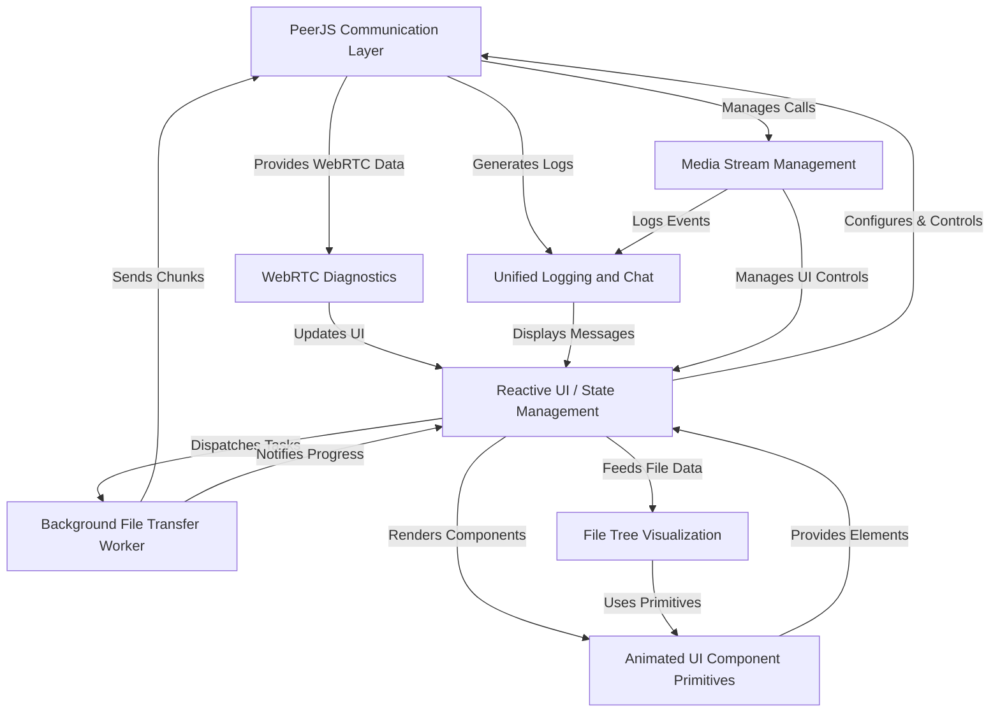
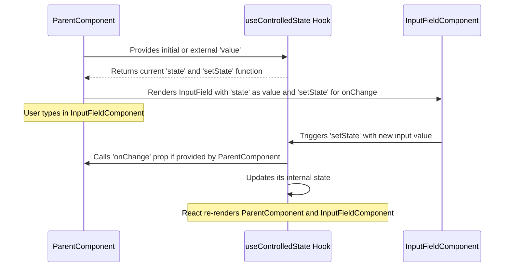
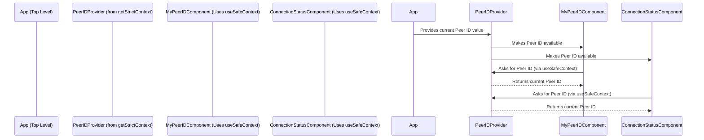
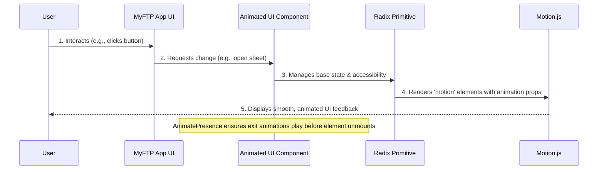

# MyFTP-peerjs Documentation

MyFTP-peerjs is a **peer-to-peer file transfer and communication application** that allows users to *directly share files and folders*, and *make audio/video calls* without needing a central server. It utilizes PeerJS to establish secure connections and provides a responsive interface for managing transfers and calls, alongside real-time connection diagnostics.


## Visual Overview



## Chapters

1. [Reactive UI / State Management
](01_reactive_ui___state_management_.md)
2. [PeerJS Communication Layer
](02_peerjs_communication_layer_.md)
3. [Background File Transfer Worker
](03_background_file_transfer_worker_.md)
4. [Media Stream Management
](04_media_stream_management_.md)
5. [Unified Logging and Chat
](05_unified_logging_and_chat_.md)
6. [WebRTC Diagnostics
](06_webrtc_diagnostics_.md)
7. [File Tree Visualization
](07_file_tree_visualization_.md)
8. [Animated UI Component Primitives
](08_animated_ui_component_primitives_.md)

---

<sub><sup>Generated by [AI Codebase Knowledge Builder](https://github.com/The-Pocket/Tutorial-Codebase-Knowledge).</sup></sub>


# Chapter 1: Reactive UI / State Management

Welcome to `MyFTP-peerjs`! In this first chapter, we're going to explore a fundamental concept in building modern applications: "Reactive UI / State Management." Don't let the fancy name scare you! It's actually a very intuitive idea, much like how a skilled musician reacts to their conductor.

### What Problem Are We Solving?

Imagine you're using an app, and something changes. Maybe you send a message, and it appears in a chat log. Or perhaps you connect to another user, and suddenly your "Connecting..." status turns into their actual ID. How does the app know to update these parts of the screen all by itself? This is exactly the problem that **Reactive UI / State Management** solves.

Think of our `MyFTP-peerjs` application. When you first open it, you see "Connecting..." as your `Peer ID`. Once the app establishes a connection, this text automatically updates to your unique ID. Or, when you send a message, it instantly appears in the chat log. We want the user interface (UI) to *react* to these changes seamlessly, just like a conductor guides an orchestra to play the right notes at the right time.

Our goal in this chapter is to understand how `MyFTP-peerjs` achieves this responsiveness, making sure all parts of the app are synchronized and showing the most current information.

### Core Concepts: The Building Blocks of a Reactive UI

Let's break down the main ideas:

#### 1. State: The Memory of Your Application

In programming, **state** is simply data that an application remembers and uses. It's like the current settings or facts about your app at any given moment. For example:

*   The `Peer ID` shown on the screen is a piece of state.
*   The list of `logs` (chat messages and events) is a piece of state.
*   Whether your `microphone is enabled` or `camera is enabled` is also state.

When this state changes, the UI needs to update.

#### 2. Reacting to Changes: How the UI Stays Fresh

A **reactive UI** means that when the underlying state changes, the parts of the user interface that depend on that state automatically "react" and update themselves. You don't have to manually tell each button or text field to redraw. It's like a smart display board that shows new information as soon as it's available.

In `MyFTP-peerjs`, we use a popular library called **React** to build our UI. React provides special tools, called "hooks," to manage state and make the UI reactive. Let's look at the most common ones.

#### 3. `useState`: React's Simplest Memory Tool

The `useState` hook is your go-to tool for adding state to a React component. It's like having a little notepad where your component can write down and remember a value. When you update the value on the notepad, React automatically knows to re-render the parts of your UI that use that value.

Here's how `myId` changes in `app/page.tsx`:

```tsx
// Inside app/page.tsx
import { useState } from "react";

// ... other code ...

export default function Home() {
  const [myId, setMyId] = useState("Connecting..."); // Initial state: "Connecting..."

  // ... other code ...

  // Later, when the PeerJS connection is open:
  // Inside the makePeer function:
  peer.on("open", (id) => {
    setMyId(id); // Update the state with the actual ID
    // ... pushLog("Peer ready. ID: ${id}"); ...
  });

  // ... In the UI, myId is displayed:
  // <button> {myId} </button>
}
```
**Explanation**:
1.  `const [myId, setMyId] = useState("Connecting...");` declares a state variable `myId` with an initial value of "Connecting...". It also gives us a function `setMyId` to update `myId`.
2.  When `setMyId(id);` is called, `myId` changes its value.
3.  React detects this change and automatically re-renders any part of the UI that uses `myId` (like the button displaying it), showing the new ID without you having to manually refresh the page.

Another example is our `logs` state, which tracks all messages:

```tsx
// Inside app/page.tsx
import { useState } from "react";

// ... other code ...

export default function Home() {
  const [logs, setLogs] = useState<LogRow[]>([]); // Initial state: an empty list of logs

  // ... other code ...

  const pushLog = useCallback((line: string, error = false) => {
    // ... create log row ...
    setLogs((prev) => [...prev, { id: Date.now() + Math.random(), text, error }]); // Add new log to the list
  }, []);

  // ... In the UI, logs are displayed:
  // <div> {logs.map(...) } </div>
}
```
**Explanation**:
1.  `const [logs, setLogs] = useState<LogRow[]>([]);` initializes `logs` as an empty array.
2.  The `pushLog` function uses `setLogs` to add a new entry to the `logs` array.
3.  React sees that the `logs` array has changed (a new item was added) and updates the UI to show the new log entry.

#### 4. `useEffect`: Performing Actions Based on State Changes

While `useState` is for remembering values, `useEffect` is for *doing things* (side effects) in response to those values or when your component first appears. Think of it as a supervisor that says, "Okay, whenever *this* changes, do *that*."

A common use case in `MyFTP-peerjs` is making the chat log automatically scroll to the bottom when new messages arrive:

```tsx
// Inside app/page.tsx
import { useEffect, useRef } from "react";

// ... other code ...

export default function Home() {
  // ... logs state ...
  const logContainerRef = useRef<HTMLDivElement | null>(null); // A way to "touch" a specific HTML element

  // ... other code ...

  useEffect(() => {
    if (logContainerRef.current) {
      logContainerRef.current.scrollTop = logContainerRef.current.scrollHeight;
    }
  }, [logs]); // This effect runs whenever 'logs' changes
}
```
**Explanation**:
1.  We use `useRef` to get a direct reference to the HTML `div` element that displays our logs.
2.  `useEffect(() => { ... }, [logs]);` tells React: "Run the code inside this function every time the `logs` state variable changes."
3.  Inside the effect, we set the `scrollTop` property of the `logContainerRef` to `scrollHeight`, which forces the `div` to scroll to its very bottom, showing the newest message.

Another example of `useEffect` is initializing the PeerJS client when the page loads:

```tsx
// Inside app/page.tsx
import { useEffect } from "react";

// ... other code ...

export default function Home() {
  // ... myId and other states ...
  // ... makePeer function ...

  useEffect(() => {
    const peerInitTimer = window.setTimeout(() => {
      makePeer(); // Call the function to set up PeerJS
    }, 0);

    return () => {
      window.clearTimeout(peerInitTimer);
      // ... cleanup PeerJS connection ...
    };
  }, [makePeer]); // This effect runs once when makePeer is stable (usually on component mount)
}
```
**Explanation**:
1.  This `useEffect` uses an empty dependency array (`[]`) to indicate that it should only run *once* after the component first renders (like `componentDidMount` in older React).
2.  It sets a small timeout and then calls `makePeer()` to start connecting to the PeerJS server.
3.  The `return` function is for cleanup. If the `Home` component were to disappear from the screen, this cleanup code would run to stop the PeerJS connection and prevent memory leaks.

### Advanced State Management with Custom Utilities

React also allows us to build our own "custom hooks" that combine `useState` and `useEffect` (and other hooks) to create reusable logic. `MyFTP-peerjs` uses a couple of powerful custom utilities: `useControlledState` and `getStrictContext`.

#### 1. `useControlledState`: Smart Input Fields

Many times, an input field (like a text box) needs to have its value managed by React state, but also allow an initial `defaultValue` or an external `value` to be passed in. The `useControlledState` hook simplifies this common pattern, ensuring your input fields behave predictably.

Think of it like a remote control for your TV. You can either change the channel directly on the TV (like typing in an uncontrolled input), or the remote control (a parent component) can set the channel for you, and you can still change it with the remote. `useControlledState` helps manage this balance.

Here's a simplified version of its use for `targetId` and `message` in `app/page.tsx`:

```tsx
// Inside app/page.tsx
import { useState } from "react"; // (Conceptually, it would use useControlledState)

// ... other code ...

export default function Home() {
  const [targetId, setTargetId] = useState(() => {
    // ... logic to get ID from URL ...
    return "";
  });
  const [message, setMessage] = useState("");

  // ... other code ...

  // Input field for targetId:
  // <input value={targetId} onChange={(e) => setTargetId(e.target.value)} />

  // Input field for message:
  // <input value={message} onChange={(e) => setMessage(e.target.value)} />
}
```
While `app/page.tsx` directly uses `useState` for simplicity in these cases, `useControlledState` is designed for situations where a component might receive its `value` from a parent (making it "controlled") or manage its own `defaultValue` internally (making it "uncontrolled"). It elegantly switches between these modes.

Here's how `useControlledState` works conceptually:



#### 2. `getStrictContext`: Sharing Data Across Components

As applications grow, you often need to share state between components that are not direct parents or children. Passing data down through many levels of components is called "prop drilling," and it can get messy. `getStrictContext` (which builds upon React's `Context` API) solves this by providing a way to share data globally, like a central bulletin board that any component can read from.

While the main `app/page.tsx` in `MyFTP-peerjs` is a single large component and doesn't explicitly use `getStrictContext` for its primary state, it's a powerful utility that *would* be used if the app were broken down into smaller, reusable pieces. For example, if `Peer ID`, `Connection Status`, or `Log History` were managed in separate smaller components, `getStrictContext` would be perfect for sharing these values.

Here's a conceptual diagram of how it would work:



#### 3. `useIsMobile`: A Practical Custom Hook

The `useIsMobile` hook in `MyFTP-peerjs` is a great example of combining `useState` and `useEffect` to create a reusable piece of reactive logic. It checks if the user is on a mobile device and updates that state whenever the window size changes.

```tsx
// Inside hooks/use-mobile.ts
import * as React from "react"

const MOBILE_BREAKPOINT = 768

export function useIsMobile() {
  const [isMobile, setIsMobile] = React.useState<boolean | undefined>(undefined) // State to remember if it's mobile

  React.useEffect(() => {
    const mql = window.matchMedia(`(max-width: ${MOBILE_BREAKPOINT - 1}px)`) // Media Query
    const onChange = () => {
      setIsMobile(window.innerWidth < MOBILE_BREAKPOINT) // Update state on resize
    }
    mql.addEventListener("change", onChange) // Listen for changes
    setIsMobile(window.innerWidth < MOBILE_BREAKPOINT) // Initial check
    return () => mql.removeEventListener("change", onChange) // Clean up listener
  }, []) // Runs once on mount

  return !!isMobile // Returns true/false
}
```
**Explanation**:
1.  `useState(undefined)`: Initializes a state variable `isMobile` to store whether the screen is mobile-sized.
2.  `useEffect`:
    *   It sets up an event listener that watches for changes in the browser window's size.
    *   When the window resizes, the `onChange` function updates the `isMobile` state.
    *   It also performs an initial check.
    *   The `return` function ensures the event listener is removed when the component that uses `useIsMobile` is no longer on the screen, preventing memory leaks.
3.  `return !!isMobile`: Returns the current `isMobile` status. Any component using `useIsMobile` will automatically re-render when `isMobile` changes.

### Under the Hood: How These Utilities Are Built

Let's take a quick peek at how our custom utilities (`getStrictContext` and `useControlledState`) work internally.

#### 1. `getStrictContext` Implementation

This utility creates a React Context specifically designed to prevent usage errors. It generates a `Provider` component (to supply the value) and a `useSafeContext` hook (to consume the value).

```tsx
// --- File: lib/get-strict-context.tsx ---
import * as React from 'react';

function getStrictContext<T>(name?: string) {
  const Context = React.createContext<T | undefined>(undefined); // 1. Create a raw React Context

  const Provider = ({ value, children }: { value: T; children?: React.ReactNode }) =>
    <Context.Provider value={value}>{children}</Context.Provider>; // 2. The Provider component

  const useSafeContext = () => {
    const ctx = React.useContext(Context); // 3. Hook to get context value
    if (ctx === undefined) {
      throw new Error(`useContext must be used within ${name ?? 'a Provider'}`); // 4. Strict check!
    }
    return ctx;
  };

  return [Provider, useSafeContext] as const; // 5. Return both
}
export { getStrictContext };
```
**Explanation**:
1.  It creates a standard React `Context`.
2.  It creates a `Provider` component that uses this `Context` to make `value` available to its children.
3.  It creates a `useSafeContext` hook. This hook tries to read the value from the context.
4.  The "strict" part: If `useSafeContext` is called outside of a `Provider`, it throws an error. This helps catch mistakes early during development.
5.  It returns both the `Provider` and `useSafeContext` so they can be used together.

#### 2. `useControlledState` Implementation

This hook elegantly handles whether a component's state should be controlled by its parent (via a `value` prop) or manage its own internal state (via a `defaultValue` prop).

```tsx
// --- File: hooks/use-controlled-state.tsx ---
import * as React from 'react';

export function useControlledState<T>(props: {
  value?: T; // External value
  defaultValue?: T; // Initial internal value
  onChange?: (value: T) => void; // Callback when internal state changes
}) {
  const { value, defaultValue, onChange } = props;

  const [state, setInternalState] = React.useState<T>(
    value !== undefined ? value : (defaultValue as T), // Use value if present, else defaultValue
  );

  React.useEffect(() => {
    if (value !== undefined) setInternalState(value); // Update internal state if external value changes
  }, [value]);

  const setState = React.useCallback(
    (next: T) => {
      setInternalState(next); // Update internal state
      onChange?.(next); // Call external onChange if provided
    },
    [onChange],
  );

  return [state, setState] as const;
}
```
**Explanation**:
1.  It uses `useState` internally to hold the component's current value. It prioritizes the `value` prop if provided; otherwise, it uses `defaultValue`.
2.  An `useEffect` watches the `value` prop. If the `value` prop changes, it forces the internal state to update to match the new `value`. This is how a parent component "controls" the state.
3.  It returns the current `state` and a `setState` function. When `setState` is called, it updates the internal state *and* calls the `onChange` prop (if one was provided), letting the parent component know about the change.

### Conclusion

In this chapter, we've taken our first steps into understanding how `MyFTP-peerjs` builds a dynamic and responsive user interface. We learned about:

*   **State**: The app's memory for critical data.
*   **Reactive UI**: How the interface automatically updates when state changes.
*   **`useState`**: React's core hook for managing component-specific state.
*   **`useEffect`**: React's hook for performing actions (like scrolling or fetching data) in response to state changes or component lifecycle events.
*   **`useControlledState`**: A custom hook for smart, flexible input field management.
*   **`getStrictContext`**: A powerful utility for sharing state across many components without hassle.
*   **`useIsMobile`**: A practical example of combining `useState` and `useEffect` for real-world features.

These tools are like the conductor and musicians of our application's orchestra, ensuring everything plays in harmony. With this foundation, you now have a good grasp of how `MyFTP-peerjs` keeps its display accurate and up-to-date.

Next, we'll dive into how different peers (users) in `MyFTP-peerjs` actually talk to each other, using the [PeerJS Communication Layer](02_peerjs_communication_layer_.md).

---

<sub><sup>Generated by [AI Codebase Knowledge Builder](https://github.com/The-Pocket/Tutorial-Codebase-Knowledge).</sup></sub> <sub><sup>**References**: [[1]](https://github.com/QA380/MyFTP-peerjs/blob/c49337043009c03ceb16b45dc4d38a90c7d750ba/app/page.tsx), [[2]](https://github.com/QA380/MyFTP-peerjs/blob/c49337043009c03ceb16b45dc4d38a90c7d750ba/hooks/use-controlled-state.tsx), [[3]](https://github.com/QA380/MyFTP-peerjs/blob/c49337043009c03ceb16b45dc4d38a90c7d750ba/hooks/use-mobile.ts), [[4]](https://github.com/QA380/MyFTP-peerjs/blob/c49337043009c03ceb16b45dc4d38a90c7d750ba/lib/get-strict-context.tsx)</sup></sub>


# Chapter 8: Animated UI Component Primitives

Welcome back! In [Chapter 7: File Tree Visualization](07_file_tree_visualization_.md), we learned how `MyFTP-peerjs` skillfully organizes and displays complex file structures using an interactive tree. While that chapter focused on making our UI structured and easy to navigate, this chapter is all about making the user experience feel polished, dynamic, and truly engaging.

### What Problem Are We Solving?

Imagine using an app where everything just instantly appears and disappears. When you click a button, a menu pops up without any transition. When you hover over an icon, a tiny tooltip appears abruptly. While functional, this kind of interface can feel a bit rigid, mechanical, and even jarring. Modern users expect applications to be smooth, intuitive, and visually responsive.

Think of our `MyFTP-peerjs` application. When you hover over an icon, you expect a neat little helper text (a tooltip) to show up gracefully. When you open a settings panel, you want it to slide smoothly into view from the side. When you transfer files, you want to see a progress bar that fluidly fills up, not jump in steps.

The **Animated UI Component Primitives** system in `MyFTP-peerjs` solves this problem by acting as a "user experience choreographer." It takes the basic building blocks of our interface and teaches them to move, fade, and resize with grace and purpose. It's like having a toolkit of advanced LEGO blocks that not only snap together perfectly but also gracefully animate, making the entire user interface dynamic and enjoyable to interact with.

Our goal in this chapter is to understand how `MyFTP-peerjs` uses these animated primitives to create a delightful and intuitive user experience, covering elements like Tooltips, Sheets (side panels), Progress bars, and Checkboxes.

### Core Concepts: The Choreography of the Interface

Let's break down the main ideas that bring our UI to life with animations.

#### 1. `motion/react` (Framer Motion): The Animation Maestro

The heart of our animations is a powerful library called **Framer Motion**, which we use through `motion/react`. This library is like a maestro conducting an orchestra: it provides simple yet powerful tools to describe how elements should animate, fade, scale, or move.

*   **`motion.div` (and `motion` anything!)**: Instead of a regular `div` or `span`, we use `motion.div` (or `motion.span`, `motion.svg`, etc.). These are "smart" versions of HTML elements that understand animation properties.
*   **`initial`**: Defines the starting appearance of an element (e.g., `opacity: 0` for invisible).
*   **`animate`**: Defines the target appearance (e.g., `opacity: 1` for fully visible). Framer Motion automatically creates the smooth animation between `initial` and `animate`.
*   **`exit`**: Defines the appearance when an element is removed from the screen.
*   **`transition`**: Specifies *how* the animation should happen (e.g., `type: 'spring'` for a bouncy feel, `duration` for how long it takes).
*   **`AnimatePresence`**: This special component from Framer Motion is crucial for `exit` animations. It ensures that components have enough time to play their `exit` animation *before* they are actually removed from the screen.

#### 2. `radix-ui`: The Accessible Foundation

While `motion/react` handles the *how* of animation, **Radix UI** provides the *what*. Radix UI is a collection of high-quality, unstyled (meaning they don't come with any visual styling) components that focus on:

*   **Accessibility**: Ensuring the components work well for everyone, including users with disabilities, by handling keyboard navigation, ARIA attributes, and focus management.
*   **Primitives**: Providing the bare-bones, functional logic for common UI patterns like Tooltips, Dialogs (Sheets), Checkboxes, etc., without telling us how they *look*. This gives us complete freedom to style them as we wish, or, in our case, *animate* them.

#### 3. Composition: Combining Power

The magic happens when we combine `motion/react` and `radix-ui`. We take a robust, accessible primitive from Radix UI and "wrap" it with `motion/react`'s animation capabilities. This gives us components that are both accessible and beautifully animated.

#### 4. Reusable State Management: `getStrictContext` & `useControlledState`

As we saw in [Chapter 1: Reactive UI / State Management](01_reactive_ui___state_management_.md), `MyFTP-peerjs` uses custom hooks like `getStrictContext` and `useControlledState`. These are heavily utilized within our `animate-ui` components to:

*   **`useControlledState`**: Manage the internal state of a component (like whether a Tooltip is `open` or `closed`), while also allowing a parent component to control that state if needed.
*   **`getStrictContext`**: Share this state easily between different parts of a composite component (e.g., a `Tooltip` component and its `TooltipContent`).

### How to Use: Adding Sparkle to the UI

Let's look at some examples of how `MyFTP-peerjs` uses these animated UI components. You'll find these components within the `components/animate-ui` directory.

#### 1. Animated Tooltip

Tooltips provide helpful information on hover. Our animated tooltip smoothly fades and scales into view.

**Example Use (Conceptual for an icon button):**

```tsx
// Imagine this in your main UI file
import { Tooltip, TooltipTrigger, TooltipContent } from '@/components/animate-ui/components/radix/tooltip';

export default function MyComponent() {
  return (
    <Tooltip>
      <TooltipTrigger asChild>
        <button className="icon-button">
          {/* Your icon here */}
          <span>?</span>
        </button>
      </TooltipTrigger>
      <TooltipContent side="bottom" className="bg-slate-800 text-white p-2 rounded">
        This is a helpful tip!
      </TooltipContent>
    </Tooltip>
  );
}
```

**What happens**: When you hover over the button, the `TooltipContent` gracefully fades in, slightly scales up, and might subtly follow your cursor (if `followCursor` is enabled). When you move your mouse away, it animates back out.

#### 2. Animated Sheet (Side Panel)

A Sheet is a panel that slides in from the side (or top/bottom) of the screen, often used for settings or extra details.

**Example Use (Conceptual for a settings button):**

```tsx
// Imagine this in your main UI file
import { Sheet, SheetTrigger, SheetContent, SheetHeader, SheetTitle } from '@/components/animate-ui/components/radix/sheet';
import { Settings } from 'lucide-react'; // An icon library

export default function MyComponent() {
  return (
    <Sheet>
      <SheetTrigger asChild>
        <button className="settings-button">
          <Settings size={20} />
        </button>
      </SheetTrigger>
      <SheetContent side="right" className="w-80 bg-[#030712] border-l border-slate-700 p-4">
        <SheetHeader>
          <SheetTitle className="text-xl text-white">Application Settings</SheetTitle>
        </SheetHeader>
        {/* Your settings content here */}
        <p className="text-slate-300 mt-4">Adjust your preferences.</p>
      </SheetContent>
    </Sheet>
  );
}
```

**What happens**: When you click the settings button, the `SheetContent` smoothly slides into view from the right side of the screen, revealing the settings panel. Clicking outside or pressing Esc slides it back out.

#### 3. Animated Progress Bar

Progress bars give visual feedback for ongoing operations like file transfers. Our progress bar animates its filling.

**Example Use (Conceptual for a file upload):**

```tsx
// Imagine this in your main UI file, with 'progressValue' updating from file transfer
import { Progress, ProgressIndicator } from '@/components/animate-ui/components/radix/progress';
import { useState } from 'react';

export default function MyComponent() {
  const [progressValue, setProgressValue] = useState(50); // This would update dynamically

  return (
    <div className="w-full">
      <p className="text-slate-400 mb-1">Transfer Progress: {progressValue}%</p>
      <Progress value={progressValue} className="h-2 w-full rounded-full bg-slate-700">
        <ProgressIndicator className="h-full bg-emerald-500 rounded-full" />
      </Progress>
    </div>
  );
}
```

**What happens**: As `progressValue` changes, the `ProgressIndicator` smoothly glides to its new position, giving a fluid visual representation of the transfer progress.

#### 4. Animated Checkbox

Checkboxes are standard input elements, but ours have a neat animation when checked.

**Example Use (Conceptual for a settings toggle):**

```tsx
// Imagine this in your main UI file
import { Checkbox, CheckboxIndicator } from '@/components/animate-ui/components/radix/checkbox';
import { useState } from 'react';

export default function MyComponent() {
  const [isAgreed, setIsAgreed] = useState(false);

  return (
    <div className="flex items-center space-x-2">
      <Checkbox
        id="agree"
        checked={isAgreed}
        onCheckedChange={setIsAgreed}
        className="h-4 w-4 shrink-0 rounded border border-slate-400 data-[state=checked]:bg-blue-500"
      >
        <CheckboxIndicator className="text-white" />
      </Checkbox>
      <label htmlFor="agree" className="text-slate-300 text-sm">
        I agree to the terms.
      </label>
    </div>
  );
}
```

**What happens**: When you click the checkbox, the checkmark icon animates into view with a smooth drawing motion, making the interaction feel more lively.

### Under the Hood: The Animation Assembly Line

Let's peek behind the curtain to see how these animated primitives are assembled.

#### High-level Flow: From Interaction to Animated Feedback



#### Internal Implementation: Crafting the Components

Let's dive into some of the actual code within `components/animate-ui/primitives/radix/` to see how these elements are built.

1.  **Animated Tooltip (`tooltip.tsx`)**: The `TooltipContent` is a great example of `radix-ui` and `motion/react` working together.

    ```tsx
    // From components/animate-ui/primitives/radix/tooltip.tsx (simplified)
    import { Tooltip as TooltipPrimitive } from 'radix-ui';
    import { AnimatePresence, motion } from 'motion/react';
    import { useTooltip } from './tooltip'; // Our custom context hook

    function TooltipPortal(props: any) { // Type 'any' for simplicity, actual types are more robust
      const { isOpen } = useTooltip(); // Get tooltip's open state from context
      return (
        <AnimatePresence> {/* Essential for exit animations */}
          {isOpen && (
            <TooltipPrimitive.Portal forceMount {...props} />
          )}
        </AnimatePresence>
      );
    }

    function TooltipContent({ transition = { type: 'spring', stiffness: 300 }, ...props }: any) {
      return (
        <TooltipPrimitive.Content asChild forceMount> {/* Radix primitive, passed to motion.div */}
          <motion.div
            key="popover-content" // Unique key for AnimatePresence
            initial={{ opacity: 0, scale: 0.5 }} // Start invisible and small
            animate={{ opacity: 1, scale: 1 }}   // Animate to full size and visible
            exit={{ opacity: 0, scale: 0.5 }}    // Exit by fading out and shrinking
            transition={transition}              // Use spring animation
            {...props}
          />
        </TooltipPrimitive.Content>
      );
    }
    ```
    **Explanation**:
    *   `TooltipPortal` uses `AnimatePresence`. This is crucial because when `isOpen` becomes `false` and the `TooltipPrimitive.Portal` is about to be removed, `AnimatePresence` keeps it mounted long enough for its children (`TooltipContent` in this case) to play their `exit` animation.
    *   `TooltipContent` renders `TooltipPrimitive.Content` `asChild`. This means `TooltipPrimitive.Content`'s accessibility and positioning logic is applied to the `motion.div` we provide as its child.
    *   The `motion.div` defines the `initial`, `animate`, and `exit` states for opacity and scale, creating the fade and shrink/grow effect. The `transition` prop makes it a smooth "spring" animation.

2.  **Animated Sheet (`sheet.tsx`)**: The `SheetContent` demonstrates sliding animations.

    ```tsx
    // From components/animate-ui/primitives/radix/sheet.tsx (simplified)
    import { Dialog as SheetPrimitive } from 'radix-ui';
    import { AnimatePresence, motion } from 'motion/react';

    type Side = 'top' | 'bottom' | 'left' | 'right';

    function SheetPortal(props: any) {
      const { isOpen } = useSheet();
      return (
        <AnimatePresence>
          {isOpen && (
            <SheetPrimitive.Portal forceMount {...props} />
          )}
        </AnimatePresence>
      );
    }

    function SheetContent({ side = 'right', transition = { type: 'spring', stiffness: 150 }, children, ...props }: any) {
      const axis = side === 'left' || side === 'right' ? 'x' : 'y';
      const offscreen: Record<Side, { x?: string; y?: string; opacity: number }> = {
        right: { x: '100%', opacity: 0 }, // Off-screen to the right
        left: { x: '-100%', opacity: 0 }, // Off-screen to the left
        top: { y: '-100%', opacity: 0 },
        bottom: { y: '100%', opacity: 0 },
      };

      return (
        <SheetPrimitive.Content asChild forceMount {...props}>
          <motion.div
            key="sheet-content"
            data-side={side}
            initial={offscreen[side]} // Start off-screen
            animate={{ [axis]: 0, opacity: 1 }} // Animate to on-screen (x or y is 0)
            exit={offscreen[side]}              // Exit back off-screen
            transition={transition}
          >
            {children}
          </motion.div>
        </SheetPrimitive.Content>
      );
    }
    ```
    **Explanation**:
    *   Similar to `Tooltip`, `SheetPortal` uses `AnimatePresence`.
    *   `SheetContent` calculates `offscreen` values based on the `side` prop (e.g., `x: '100%'` for `right` to start fully outside the viewport).
    *   The `motion.div` uses `initial` to place it off-screen, `animate` to bring it to its visible position (`x: 0` or `y: 0`), and `exit` to send it back off-screen.

3.  **Animated Progress Bar (`progress.tsx`)**: This component shows how to animate a property that changes over time.

    ```tsx
    // From components/animate-ui/primitives/radix/progress.tsx (simplified)
    import { Progress as ProgressPrimitive } from 'radix-ui';
    import { motion } from 'motion/react';
    import { useProgress } from './progress'; // Our custom context hook

    const MotionProgressIndicator = motion.create(ProgressPrimitive.Indicator);

    function ProgressIndicator({ transition = { type: 'spring', stiffness: 100 }, ...props }: any) {
      const { value } = useProgress(); // Get current progress value from context

      return (
        <MotionProgressIndicator
          animate={{ x: `-${100 - (value || 0)}%` }} // Animate horizontal position
          transition={transition}
          {...props}
        />
      );
    }
    ```
    **Explanation**:
    *   `motion.create(ProgressPrimitive.Indicator)` turns the Radix `ProgressPrimitive.Indicator` into a `motion` component.
    *   The `animate={{ x: -${100 - (value || 0)}% }}` is the key. If `value` is 50, it animates `x` to `-50%`, meaning it's shifted 50% from the left, thus making it appear to fill 50% of the bar. Framer Motion smoothly interpolates `x` whenever `value` changes.

4.  **Animated Checkbox (`checkbox.tsx`)**: This shows conditional path animations.

    ```tsx
    // From components/animate-ui/primitives/radix/checkbox.tsx (simplified)
    import { Checkbox as CheckboxPrimitive } from 'radix-ui';
    import { motion } from 'motion/react';
    import { useCheckbox } from './checkbox'; // Our custom context hook

    function CheckboxIndicator(props: any) {
      const { isChecked } = useCheckbox(); // Get checked state from context

      return (
        <CheckboxPrimitive.Indicator forceMount asChild>
          <motion.svg
            initial="unchecked"
            animate={isChecked ? 'checked' : 'unchecked'} // Animate based on state
            {...props}
          >
            <motion.path
              d="M4.5 12.75l6 6 9-13.5" // The SVG path for a checkmark
              variants={{ // Define animation steps for 'checked' and 'unchecked'
                checked: {
                  pathLength: 1, // Draw the entire path
                  opacity: 1,
                  transition: { duration: 0.2, delay: 0.2 },
                },
                unchecked: {
                  pathLength: 0, // Shrink the path to nothing
                  opacity: 0,
                  transition: { duration: 0.2 },
                },
              }}
            />
          </motion.svg>
        </CheckboxPrimitive.Indicator>
      );
    }
    ```
    **Explanation**:
    *   The `motion.svg` `animate`s between `checked` and `unchecked` variants based on `isChecked`.
    *   The `motion.path` within the SVG uses the `pathLength` property. Animating `pathLength` from `0` to `1` makes the SVG path appear to draw itself, creating the smooth checkmark animation.

These examples demonstrate the core pattern: combining `radix-ui` for a solid, accessible foundation with `motion/react` for elegant, customizable animations, often enhanced by our custom `getStrictContext` and `useControlledState` utilities.

### Conclusion

In this final chapter, we've explored the world of **Animated UI Component Primitives** in `MyFTP-peerjs`. We learned how this system transforms a functional interface into a delightful and dynamic user experience by:

*   Leveraging **`motion/react` (Framer Motion)** as the powerful animation engine.
*   Building upon the accessible and unstyled primitives provided by **`radix-ui`**.
*   Utilizing **composition** to combine these two libraries, creating components that are both robust and beautifully animated.
*   Applying these principles to various UI elements like Tooltips, Sheets, Progress bars, and Checkboxes to add polish and responsiveness.

By understanding these principles, you now have a comprehensive view of how `MyFTP-peerjs` is built, from its reactive core and communication layers to its efficient file handling, comprehensive logging, detailed diagnostics, intuitive file tree visualization, and finally, its engaging, animated user interface. We hope this tutorial has provided a solid foundation for understanding the project and how modern web applications are crafted!

---

<sub><sup>Generated by [AI Codebase Knowledge Builder](https://github.com/The-Pocket/Tutorial-Codebase-Knowledge).</sup></sub> <sub><sup>**References**: [[1]](https://github.com/QA380/MyFTP-peerjs/blob/c49337043009c03ceb16b45dc4d38a90c7d750ba/components/animate-ui/primitives/animate/slot.tsx), [[2]](https://github.com/QA380/MyFTP-peerjs/blob/c49337043009c03ceb16b45dc4d38a90c7d750ba/components/animate-ui/primitives/effects/highlight.tsx), [[3]](https://github.com/QA380/MyFTP-peerjs/blob/c49337043009c03ceb16b45dc4d38a90c7d750ba/components/animate-ui/primitives/radix/checkbox.tsx), [[4]](https://github.com/QA380/MyFTP-peerjs/blob/c49337043009c03ceb16b45dc4d38a90c7d750ba/components/animate-ui/primitives/radix/progress.tsx), [[5]](https://github.com/QA380/MyFTP-peerjs/blob/c49337043009c03ceb16b45dc4d38a90c7d750ba/components/animate-ui/primitives/radix/sheet.tsx), [[6]](https://github.com/QA380/MyFTP-peerjs/blob/c49337043009c03ceb16b45dc4d38a90c7d750ba/components/animate-ui/primitives/radix/tooltip.tsx), [[7]](https://github.com/QA380/MyFTP-peerjs/blob/c49337043009c03ceb16b45dc4d38a90c7d750ba/package.json)</sup></sub>