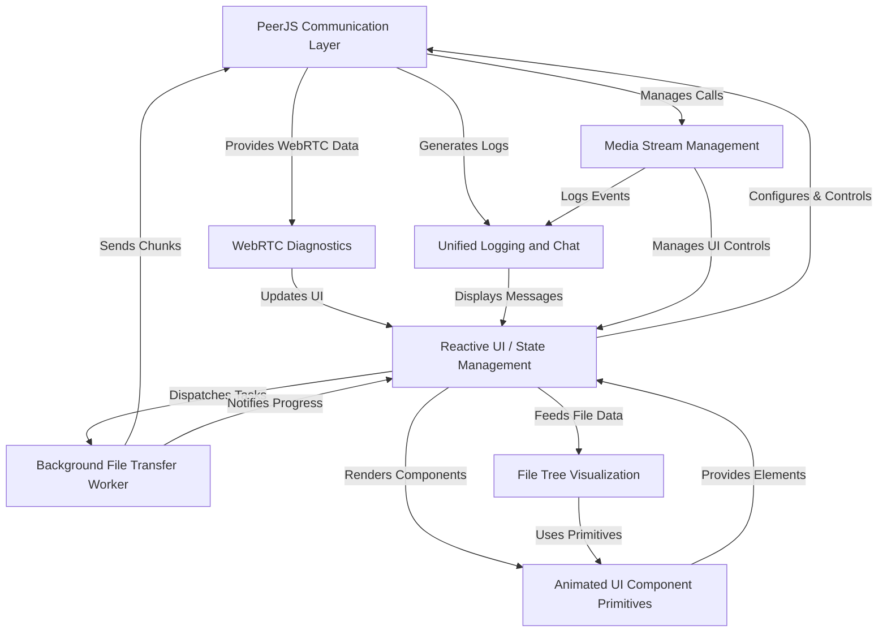
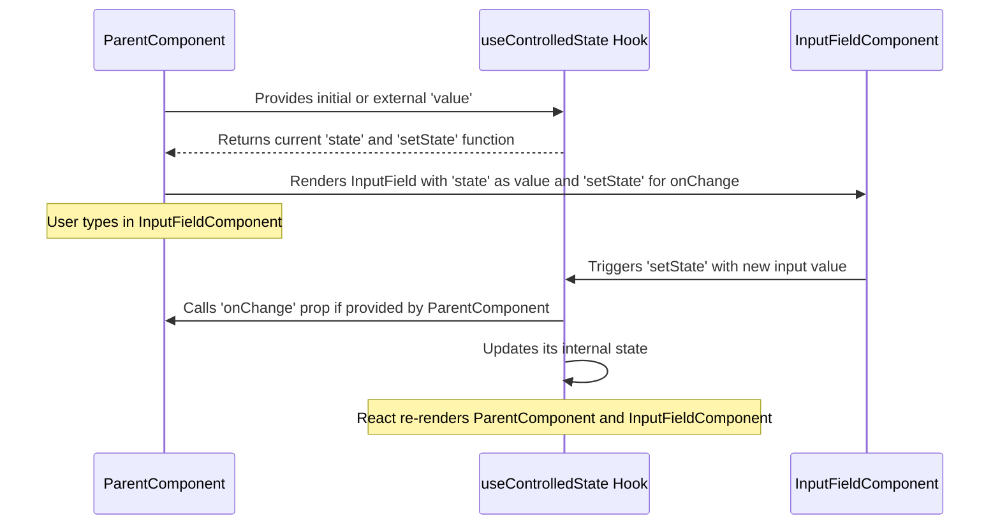
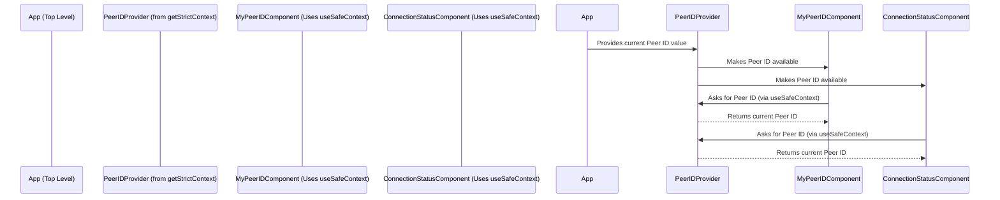
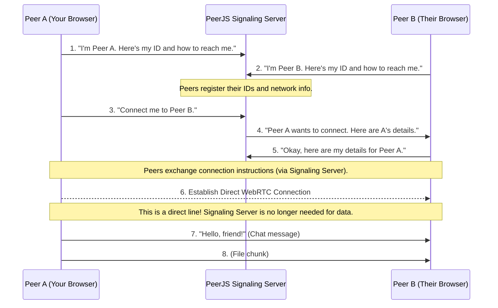
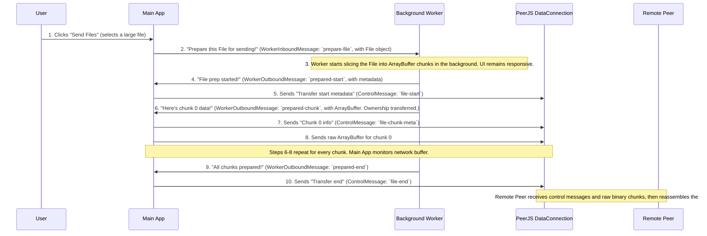
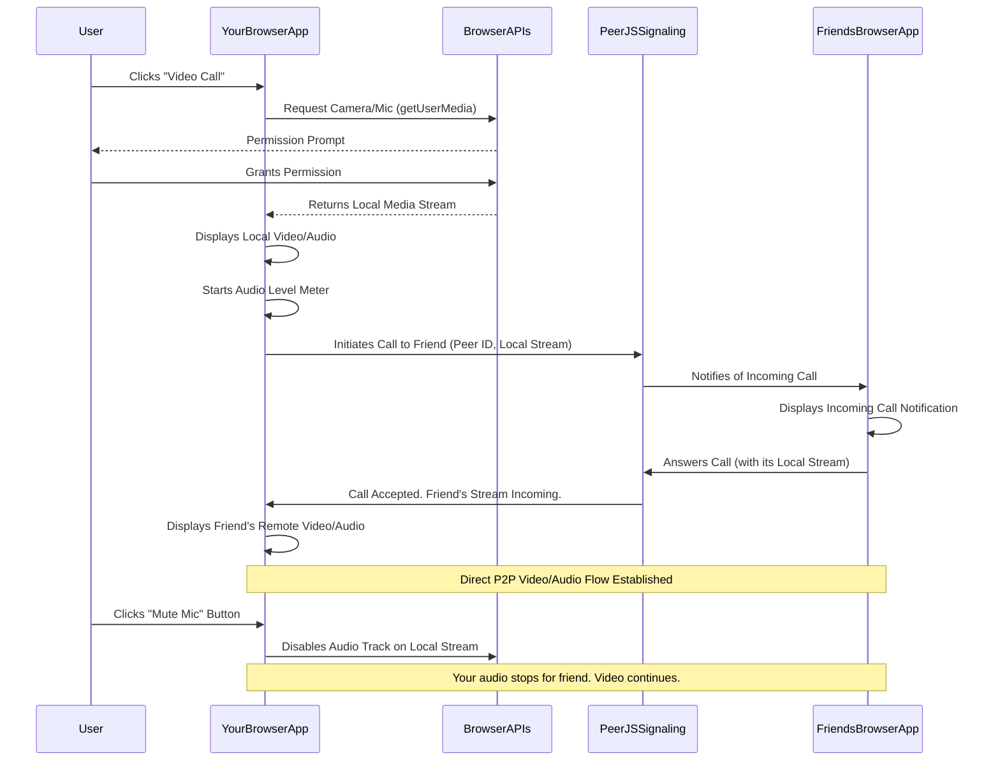
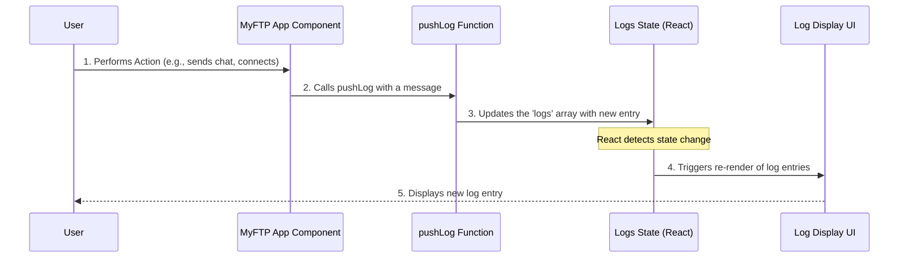
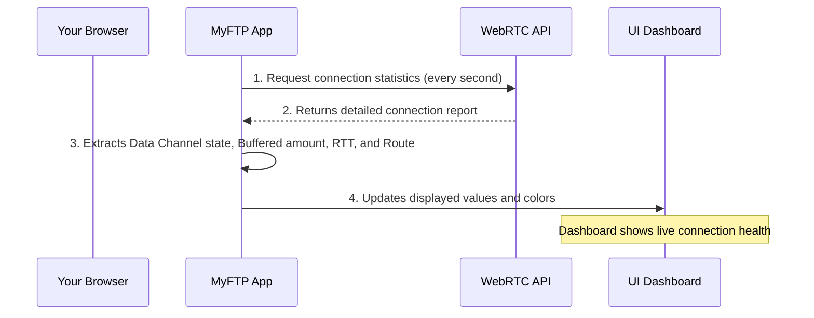
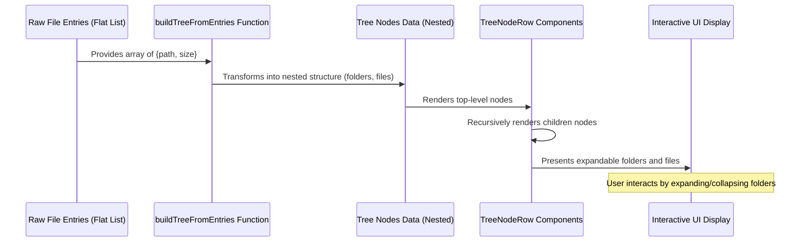
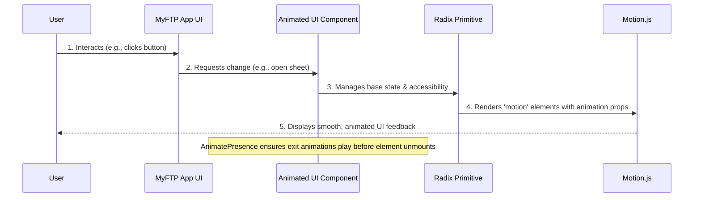

# MyFTP-peerjs Documentation

MyFTP-peerjs is a **peer-to-peer file transfer and communication application** that allows users to *directly share files and folders*, and *make audio/video calls* without needing a central server. It utilizes PeerJS to establish secure connections and provides a responsive interface for managing transfers and calls, alongside real-time connection diagnostics.


## Visual Overview



## Chapters

1. 
2. 
3. 
4. 
5. 
6. 
7. 
8. 


---


# Chapter 1: Reactive UI / State Management

Welcome to `MyFTP-peerjs`! In this first chapter, we're going to explore a fundamental concept in building modern applications: "Reactive UI / State Management." Don't let the fancy name scare you! It's actually a very intuitive idea, much like how a skilled musician reacts to their conductor.

### What Problem Are We Solving?

Imagine you're using an app, and something changes. Maybe you send a message, and it appears in a chat log. Or perhaps you connect to another user, and suddenly your "Connecting..." status turns into their actual ID. How does the app know to update these parts of the screen all by itself? This is exactly the problem that **Reactive UI / State Management** solves.

Think of our `MyFTP-peerjs` application. When you first open it, you see "Connecting..." as your `Peer ID`. Once the app establishes a connection, this text automatically updates to your unique ID. Or, when you send a message, it instantly appears in the chat log. We want the user interface (UI) to *react* to these changes seamlessly, just like a conductor guides an orchestra to play the right notes at the right time.

Our goal in this chapter is to understand how `MyFTP-peerjs` achieves this responsiveness, making sure all parts of the app are synchronized and showing the most current information.

### Core Concepts: The Building Blocks of a Reactive UI

Let's break down the main ideas:

#### 1. State: The Memory of Your Application

In programming, **state** is simply data that an application remembers and uses. It's like the current settings or facts about your app at any given moment. For example:

*   The `Peer ID` shown on the screen is a piece of state.
*   The list of `logs` (chat messages and events) is a piece of state.
*   Whether your `microphone is enabled` or `camera is enabled` is also state.

When this state changes, the UI needs to update.

#### 2. Reacting to Changes: How the UI Stays Fresh

A **reactive UI** means that when the underlying state changes, the parts of the user interface that depend on that state automatically "react" and update themselves. You don't have to manually tell each button or text field to redraw. It's like a smart display board that shows new information as soon as it's available.

In `MyFTP-peerjs`, we use a popular library called **React** to build our UI. React provides special tools, called "hooks," to manage state and make the UI reactive. Let's look at the most common ones.

#### 3. `useState`: React's Simplest Memory Tool

The `useState` hook is your go-to tool for adding state to a React component. It's like having a little notepad where your component can write down and remember a value. When you update the value on the notepad, React automatically knows to re-render the parts of your UI that use that value.

Here's how `myId` changes in `app/page.tsx`:

```tsx
// Inside app/page.tsx
import { useState } from "react";

// ... other code ...

export default function Home() {
  const [myId, setMyId] = useState("Connecting..."); // Initial state: "Connecting..."

  // ... other code ...

  // Later, when the PeerJS connection is open:
  // Inside the makePeer function:
  peer.on("open", (id) => {
    setMyId(id); // Update the state with the actual ID
    // ... pushLog("Peer ready. ID: ${id}"); ...
  });

  // ... In the UI, myId is displayed:
  // <button> {myId} </button>
}
```
**Explanation**:
1.  `const [myId, setMyId] = useState("Connecting...");` declares a state variable `myId` with an initial value of "Connecting...". It also gives us a function `setMyId` to update `myId`.
2.  When `setMyId(id);` is called, `myId` changes its value.
3.  React detects this change and automatically re-renders any part of the UI that uses `myId` (like the button displaying it), showing the new ID without you having to manually refresh the page.

Another example is our `logs` state, which tracks all messages:

```tsx
// Inside app/page.tsx
import { useState } from "react";

// ... other code ...

export default function Home() {
  const [logs, setLogs] = useState<LogRow[]>([]); // Initial state: an empty list of logs

  // ... other code ...

  const pushLog = useCallback((line: string, error = false) => {
    // ... create log row ...
    setLogs((prev) => [...prev, { id: Date.now() + Math.random(), text, error }]); // Add new log to the list
  }, []);

  // ... In the UI, logs are displayed:
  // <div> {logs.map(...) } </div>
}
```
**Explanation**:
1.  `const [logs, setLogs] = useState<LogRow[]>([]);` initializes `logs` as an empty array.
2.  The `pushLog` function uses `setLogs` to add a new entry to the `logs` array.
3.  React sees that the `logs` array has changed (a new item was added) and updates the UI to show the new log entry.

#### 4. `useEffect`: Performing Actions Based on State Changes

While `useState` is for remembering values, `useEffect` is for *doing things* (side effects) in response to those values or when your component first appears. Think of it as a supervisor that says, "Okay, whenever *this* changes, do *that*."

A common use case in `MyFTP-peerjs` is making the chat log automatically scroll to the bottom when new messages arrive:

```tsx
// Inside app/page.tsx
import { useEffect, useRef } from "react";

// ... other code ...

export default function Home() {
  // ... logs state ...
  const logContainerRef = useRef<HTMLDivElement | null>(null); // A way to "touch" a specific HTML element

  // ... other code ...

  useEffect(() => {
    if (logContainerRef.current) {
      logContainerRef.current.scrollTop = logContainerRef.current.scrollHeight;
    }
  }, [logs]); // This effect runs whenever 'logs' changes
}
```
**Explanation**:
1.  We use `useRef` to get a direct reference to the HTML `div` element that displays our logs.
2.  `useEffect(() => { ... }, [logs]);` tells React: "Run the code inside this function every time the `logs` state variable changes."
3.  Inside the effect, we set the `scrollTop` property of the `logContainerRef` to `scrollHeight`, which forces the `div` to scroll to its very bottom, showing the newest message.

Another example of `useEffect` is initializing the PeerJS client when the page loads:

```tsx
// Inside app/page.tsx
import { useEffect } from "react";

// ... other code ...

export default function Home() {
  // ... myId and other states ...
  // ... makePeer function ...

  useEffect(() => {
    const peerInitTimer = window.setTimeout(() => {
      makePeer(); // Call the function to set up PeerJS
    }, 0);

    return () => {
      window.clearTimeout(peerInitTimer);
      // ... cleanup PeerJS connection ...
    };
  }, [makePeer]); // This effect runs once when makePeer is stable (usually on component mount)
}
```
**Explanation**:
1.  This `useEffect` uses an empty dependency array (`[]`) to indicate that it should only run *once* after the component first renders (like `componentDidMount` in older React).
2.  It sets a small timeout and then calls `makePeer()` to start connecting to the PeerJS server.
3.  The `return` function is for cleanup. If the `Home` component were to disappear from the screen, this cleanup code would run to stop the PeerJS connection and prevent memory leaks.

### Advanced State Management with Custom Utilities

React also allows us to build our own "custom hooks" that combine `useState` and `useEffect` (and other hooks) to create reusable logic. `MyFTP-peerjs` uses a couple of powerful custom utilities: `useControlledState` and `getStrictContext`.

#### 1. `useControlledState`: Smart Input Fields

Many times, an input field (like a text box) needs to have its value managed by React state, but also allow an initial `defaultValue` or an external `value` to be passed in. The `useControlledState` hook simplifies this common pattern, ensuring your input fields behave predictably.

Think of it like a remote control for your TV. You can either change the channel directly on the TV (like typing in an uncontrolled input), or the remote control (a parent component) can set the channel for you, and you can still change it with the remote. `useControlledState` helps manage this balance.

Here's a simplified version of its use for `targetId` and `message` in `app/page.tsx`:

```tsx
// Inside app/page.tsx
import { useState } from "react"; // (Conceptually, it would use useControlledState)

// ... other code ...

export default function Home() {
  const [targetId, setTargetId] = useState(() => {
    // ... logic to get ID from URL ...
    return "";
  });
  const [message, setMessage] = useState("");

  // ... other code ...

  // Input field for targetId:
  // <input value={targetId} onChange={(e) => setTargetId(e.target.value)} />

  // Input field for message:
  // <input value={message} onChange={(e) => setMessage(e.target.value)} />
}
```
While `app/page.tsx` directly uses `useState` for simplicity in these cases, `useControlledState` is designed for situations where a component might receive its `value` from a parent (making it "controlled") or manage its own `defaultValue` internally (making it "uncontrolled"). It elegantly switches between these modes.

Here's how `useControlledState` works conceptually:



#### 2. `getStrictContext`: Sharing Data Across Components

As applications grow, you often need to share state between components that are not direct parents or children. Passing data down through many levels of components is called "prop drilling," and it can get messy. `getStrictContext` (which builds upon React's `Context` API) solves this by providing a way to share data globally, like a central bulletin board that any component can read from.

While the main `app/page.tsx` in `MyFTP-peerjs` is a single large component and doesn't explicitly use `getStrictContext` for its primary state, it's a powerful utility that *would* be used if the app were broken down into smaller, reusable pieces. For example, if `Peer ID`, `Connection Status`, or `Log History` were managed in separate smaller components, `getStrictContext` would be perfect for sharing these values.

Here's a conceptual diagram of how it would work:



#### 3. `useIsMobile`: A Practical Custom Hook

The `useIsMobile` hook in `MyFTP-peerjs` is a great example of combining `useState` and `useEffect` to create a reusable piece of reactive logic. It checks if the user is on a mobile device and updates that state whenever the window size changes.

```tsx
// Inside hooks/use-mobile.ts
import * as React from "react"

const MOBILE_BREAKPOINT = 768

export function useIsMobile() {
  const [isMobile, setIsMobile] = React.useState<boolean | undefined>(undefined) // State to remember if it's mobile

  React.useEffect(() => {
    const mql = window.matchMedia(`(max-width: ${MOBILE_BREAKPOINT - 1}px)`) // Media Query
    const onChange = () => {
      setIsMobile(window.innerWidth < MOBILE_BREAKPOINT) // Update state on resize
    }
    mql.addEventListener("change", onChange) // Listen for changes
    setIsMobile(window.innerWidth < MOBILE_BREAKPOINT) // Initial check
    return () => mql.removeEventListener("change", onChange) // Clean up listener
  }, []) // Runs once on mount

  return !!isMobile // Returns true/false
}
```
**Explanation**:
1.  `useState(undefined)`: Initializes a state variable `isMobile` to store whether the screen is mobile-sized.
2.  `useEffect`:
    *   It sets up an event listener that watches for changes in the browser window's size.
    *   When the window resizes, the `onChange` function updates the `isMobile` state.
    *   It also performs an initial check.
    *   The `return` function ensures the event listener is removed when the component that uses `useIsMobile` is no longer on the screen, preventing memory leaks.
3.  `return !!isMobile`: Returns the current `isMobile` status. Any component using `useIsMobile` will automatically re-render when `isMobile` changes.

### Under the Hood: How These Utilities Are Built

Let's take a quick peek at how our custom utilities (`getStrictContext` and `useControlledState`) work internally.

#### 1. `getStrictContext` Implementation

This utility creates a React Context specifically designed to prevent usage errors. It generates a `Provider` component (to supply the value) and a `useSafeContext` hook (to consume the value).

```tsx
// --- File: lib/get-strict-context.tsx ---
import * as React from 'react';

function getStrictContext<T>(name?: string) {
  const Context = React.createContext<T | undefined>(undefined); // 1. Create a raw React Context

  const Provider = ({ value, children }: { value: T; children?: React.ReactNode }) =>
    <Context.Provider value={value}>{children}</Context.Provider>; // 2. The Provider component

  const useSafeContext = () => {
    const ctx = React.useContext(Context); // 3. Hook to get context value
    if (ctx === undefined) {
      throw new Error(`useContext must be used within ${name ?? 'a Provider'}`); // 4. Strict check!
    }
    return ctx;
  };

  return [Provider, useSafeContext] as const; // 5. Return both
}
export { getStrictContext };
```
**Explanation**:
1.  It creates a standard React `Context`.
2.  It creates a `Provider` component that uses this `Context` to make `value` available to its children.
3.  It creates a `useSafeContext` hook. This hook tries to read the value from the context.
4.  The "strict" part: If `useSafeContext` is called outside of a `Provider`, it throws an error. This helps catch mistakes early during development.
5.  It returns both the `Provider` and `useSafeContext` so they can be used together.

#### 2. `useControlledState` Implementation

This hook elegantly handles whether a component's state should be controlled by its parent (via a `value` prop) or manage its own internal state (via a `defaultValue` prop).

```tsx
// --- File: hooks/use-controlled-state.tsx ---
import * as React from 'react';

export function useControlledState<T>(props: {
  value?: T; // External value
  defaultValue?: T; // Initial internal value
  onChange?: (value: T) => void; // Callback when internal state changes
}) {
  const { value, defaultValue, onChange } = props;

  const [state, setInternalState] = React.useState<T>(
    value !== undefined ? value : (defaultValue as T), // Use value if present, else defaultValue
  );

  React.useEffect(() => {
    if (value !== undefined) setInternalState(value); // Update internal state if external value changes
  }, [value]);

  const setState = React.useCallback(
    (next: T) => {
      setInternalState(next); // Update internal state
      onChange?.(next); // Call external onChange if provided
    },
    [onChange],
  );

  return [state, setState] as const;
}
```
**Explanation**:
1.  It uses `useState` internally to hold the component's current value. It prioritizes the `value` prop if provided; otherwise, it uses `defaultValue`.
2.  An `useEffect` watches the `value` prop. If the `value` prop changes, it forces the internal state to update to match the new `value`. This is how a parent component "controls" the state.
3.  It returns the current `state` and a `setState` function. When `setState` is called, it updates the internal state *and* calls the `onChange` prop (if one was provided), letting the parent component know about the change.

### Conclusion

In this chapter, we've taken our first steps into understanding how `MyFTP-peerjs` builds a dynamic and responsive user interface. We learned about:

*   **State**: The app's memory for critical data.
*   **Reactive UI**: How the interface automatically updates when state changes.
*   **`useState`**: React's core hook for managing component-specific state.
*   **`useEffect`**: React's hook for performing actions (like scrolling or fetching data) in response to state changes or component lifecycle events.
*   **`useControlledState`**: A custom hook for smart, flexible input field management.
*   **`getStrictContext`**: A powerful utility for sharing state across many components without hassle.
*   **`useIsMobile`**: A practical example of combining `useState` and `useEffect` for real-world features.

These tools are like the conductor and musicians of our application's orchestra, ensuring everything plays in harmony. With this foundation, you now have a good grasp of how `MyFTP-peerjs` keeps its display accurate and up-to-date.

Next, we'll dive into how different peers (users) in `MyFTP-peerjs` actually talk to each other, using the [PeerJS Communication Layer](02_peerjs_communication_layer_.md).

---


# Chapter 2: PeerJS Communication Layer

Welcome back! In [Chapter 1: Reactive UI / State Management](01_reactive_ui___state_management_.md), we learned how `MyFTP-peerjs` keeps its user interface fresh and responsive by reacting to changes in data (state). Now that our application knows *what* to display, the next big question is: how do two users, possibly thousands of miles apart, actually talk to each other directly?

### What Problem Are We Solving?

Imagine you want to send a message or a file to a friend using an app like `MyFTP-peerjs`. Normally, when you send a message, it goes to a central server, which then delivers it to your friend. This is like sending a letter through the post office. It works, but it means a third party (the server) always handles your data.

**PeerJS Communication Layer** solves this by acting as a digital switchboard operator. It helps you and your friend find each other by your unique IDs (like digital phone numbers) and then, crucially, helps you establish a **direct line** between your two computers. Once that direct line is open, your messages, files, and even video calls can go straight from you to your friend, without constantly passing through a central server for the actual data exchange. This makes communication faster, more private, and more efficient.

Our goal in this chapter is to understand how `MyFTP-peerjs` uses this "switchboard" to let users connect, send chat messages, and lay the groundwork for file transfers and calls.

### Core Concepts: The Pillars of Peer-to-Peer Talk

Let's break down the main ideas that make direct communication possible.

#### 1. Peer-to-Peer (P2P): Direct Talk

**Peer-to-Peer (P2P)** means that two devices (called "peers") communicate directly with each other, rather than through a central server that forwards every piece of data.

Think of it like this:

*   **Server-based (traditional)**: You send a letter to the post office (server), the post office reads the address, and then sends it to your friend.
*   **Peer-to-Peer**: You get your friend's direct phone number, dial it, and talk directly. No need for a "post office" to listen to every word of your conversation.

#### 2. PeerJS: The WebRTC Simplifier

Building direct connections between browsers using something called **WebRTC** (Web Real-Time Communication) can be quite complex. That's where **PeerJS** comes in! PeerJS is a library that makes using WebRTC much, much easier. It handles all the complicated bits, like figuring out how to connect devices that are behind different internet routers or firewalls.

#### 3. Peer ID: Your Unique Digital Address

Just like a phone number, each user in `MyFTP-peerjs` needs a **unique Peer ID**. This ID is how other users can find and connect to you. When you open `MyFTP-peerjs`, the app automatically generates or receives a Peer ID from a special server.

#### 4. Signaling Server: The Matchmaker

Even though data flows directly in P2P, there's still a small initial step where peers need help finding each other. This is where a **Signaling Server** comes in. It doesn't handle your actual messages or files. Instead, it acts like a "matchmaker" or a "phone directory" service:

*   You tell it your Peer ID.
*   You ask it for another user's "connection instructions" (technical details like IP addresses and network paths).
*   Once you have those instructions, you can bypass the Signaling Server and connect directly.

#### 5. DataConnection and MediaConnection: The Communication Channels

Once two peers are connected, PeerJS gives us two main types of "pipes" or channels for sending information:

*   **`DataConnection`**: This is a channel for sending any kind of digital data, like text messages, file chunks, or game data. It's like sending text messages over your direct line.
*   **`MediaConnection`**: This is a channel specifically for real-time audio and video streams. It's like having a voice or video call over your direct line.

### How to Use: Connecting and Sending a Chat Message

Let's see how `MyFTP-peerjs` uses these concepts to let you connect to another user and send a simple chat message.

#### Step 1: Get Your Own Peer ID

When `MyFTP-peerjs` starts, it needs to get a unique Peer ID for your browser. This involves creating a `Peer` object from the PeerJS library.

```typescript
// Inside app/page.tsx (simplified)

// ... other imports ...
import Peer from "peerjs";

export default function Home() {
  const [myId, setMyId] = useState("Connecting..."); // From Chapter 1

  const makePeer = useCallback(() => {
    // ... setup PeerJS options like host, port, path ...

    const peer = new Peer(options); // Create your Peer object!
    // A random ID can also be passed here, e.g., new Peer('mycustomid', options);

    peer.on("open", (id) => {
      setMyId(id); // React automatically updates myId on the screen
      // ... pushLog(`Peer ready. ID: ${id}`); ...
    });

    // ... handle incoming connections, calls, errors ...
  }, [/* dependencies */]);

  // Use useEffect to run makePeer when the component loads (from Chapter 1)
  useEffect(() => {
    const peerInitTimer = window.setTimeout(() => {
      makePeer();
    }, 0);
    return () => {
      window.clearTimeout(peerInitTimer);
      // ... cleanup PeerJS connection ...
    };
  }, [makePeer]);
}
```
**Explanation**:
1.  We import the `Peer` object from the `peerjs` library.
2.  Inside `makePeer`, we create a new `Peer` instance, passing it configuration options (like which PeerJS Signaling Server to use).
3.  The `peer.on("open", (id) => { ... })` part is crucial. When your PeerJS client successfully connects to the Signaling Server and gets its unique ID, this `open` event fires.
4.  `setMyId(id)` updates the `myId` state, and thanks to [Chapter 1: Reactive UI / State Management](01_reactive_ui___state_management_.md), your UI automatically shows your new ID!

#### Step 2: Connect to a Target Peer ID

Once you have your Peer ID, you can use `MyFTP-peerjs` to enter someone else's Peer ID and try to connect to them.

```typescript
// Inside app/page.tsx (simplified)

export default function Home() {
  // ... myId state ...
  const [targetId, setTargetId] = useState(""); // State for the ID you want to connect to

  const connectToTarget = useCallback(() => {
    // ... basic checks ...
    const trimmedTargetId = targetId.trim();

    // peerRef.current holds our PeerJS instance created in makePeer
    const conn = peerRef.current.connect(trimmedTargetId, {
      reliable: true,      // Ensures messages arrive in order
      serialization: "raw",// Best for large file transfers
    });

    conn.on("open", () => wireConnection(conn)); // Set up event handlers when connection is ready
  }, [targetId, wireConnection]); // wireConnection is explained next
}
```
**Explanation**:
1.  `peerRef.current.connect(trimmedTargetId, { ... })` is the key function. It tells PeerJS to initiate a `DataConnection` to the specified `targetId`.
2.  `reliable: true` ensures that data is delivered in the correct order and re-sent if lost, which is important for things like file transfers.
3.  `serialization: "raw"` is chosen for optimal performance when sending raw binary data (like file chunks).
4.  Once PeerJS successfully establishes this connection, the `open` event on the `conn` object fires, and we call `wireConnection(conn)` to set up more specific handlers.

#### Step 3: Handle Incoming and Outgoing Data (Chat Messages)

Now that a direct `DataConnection` is established, we need to define what happens when data arrives or when we want to send data. The `wireConnection` function takes care of this.

```typescript
// Inside app/page.tsx (simplified)

type ControlMessage = { kind: "chat-message"; text: string; } | /* ... other message types ... */;

export default function Home() {
  // ... logs state ...
  // ... message and sender states ...

  const pushLog = useCallback(/* ... function from Chapter 1 ... */);

  const sendControlMessage = useCallback((conn: DataConnection, payload: ControlMessage) => {
    conn.send(JSON.stringify(payload)); // We send JSON for control messages
  }, []);

  const wireConnection = useCallback(
    (conn: DataConnection) => {
      activeConnRef.current = conn; // Keep track of the active connection
      // ... setConnState(`Connected to ${conn.peer}`); ...
      pushLog(`Connection opened with ${conn.peer}`);

      conn.on("data", (data) => {
        // This is where ALL incoming data arrives!
        if (typeof data === "string") {
          const control = parseControlMessage(data); // Try to parse as our custom control message
          if (control?.kind === "chat-message") {
            pushLog(`Received: ${control.text}`);
          } else {
            pushLog(`Received: ${data}`); // Fallback for plain strings
          }
        } else {
          // This block handles raw binary data (e.g., file chunks)
          // ... logic for file chunks ...
        }
      });

      // ... conn.on("close", ...) and conn.on("error", ...) ...
    },
    [parseControlMessage, pushLog] // parseControlMessage will be a simple JSON.parse
  );

  const sendCurrentMessage = useCallback(() => {
    // ... check if activeConnRef.current exists ...
    const text = message.trim();
    if (!text) { /* ... handle empty message ... */ return; }

    const payload = sender.trim() ? `${sender.trim()}: ${text}` : text;

    if (activeConnRef.current) {
      sendControlMessage(activeConnRef.current, { // Use our helper to send
        kind: "chat-message",
        text: payload,
      });
    }
    pushLog(`Sent: ${payload}`);
    setMessage(""); // Clear the input field (from Chapter 1)
  }, [message, pushLog, sendControlMessage, sender]);
}
```
**Explanation**:
1.  **`wireConnection`**: This function is called once a `DataConnection` is established (either you connected to someone, or someone connected to you).
2.  **`conn.on("data", (data) => { ... })`**: This is the listener for all incoming data on this specific connection.
    *   It first checks if the data is a `string`. If so, it tries to parse it as one of our custom `ControlMessage` types (like `"chat-message"`).
    *   If it's a `chat-message`, it extracts the `text` and displays it in the log using `pushLog`.
    *   If it's not a `string` (i.e., it's binary data), it means it's likely part of a file transfer (which we'll cover in the next chapter!).
3.  **`sendCurrentMessage`**: This function is called when you click the "Send" button.
    *   It creates a `ControlMessage` object with `kind: "chat-message"` and the message text.
    *   `sendControlMessage` converts this object to a JSON string and sends it over the `activeConnRef.current.send()` method.
    *   `pushLog` displays your sent message in your own log.

This completes the basic cycle of connection and chat!

### Under the Hood: The Digital Switchboard Operator

How does PeerJS (our "digital switchboard operator") help two peers find each other and establish a direct connection?

Let's imagine "Peer A" (your browser) wants to connect to "Peer B" (your friend's browser).

1.  **Peer A initializes**: When you open `MyFTP-peerjs`, your browser (Peer A) connects to the PeerJS Signaling Server. It says, "Hi, I'm Peer A, here's my ID. If anyone wants to find me, you can tell them how."
2.  **Peer B initializes**: Similarly, your friend's browser (Peer B) connects to the same Signaling Server and registers its ID.
3.  **Peer A wants to call Peer B**: You enter Peer B's ID in your app and click "Connect". Your app tells the PeerJS Signaling Server, "I want to connect to Peer B. Can you introduce us?"
4.  **Signaling Server introduces them**: The Signaling Server facilitates the exchange of "connection instructions" (known as ICE candidates and SDP offers/answers in WebRTC) between Peer A and Peer B. These instructions are like telling each peer, "Here are the best ways to reach me directly."
5.  **Direct Connection is Established**: Once Peer A and Peer B have exchanged enough information, they no longer need the Signaling Server. They can now establish a direct connection (using WebRTC) between their two browsers. This direct connection is used for all subsequent data (chat, files, video).

Here's a simplified sequence of events:



### Internal Implementation: A Glimpse into the Code

Let's dive a bit deeper into the `app/page.tsx` file to see how these PeerJS interactions are set up.

#### 1. Initializing PeerJS (`makePeer` function)

The `makePeer` function is responsible for creating your PeerJS client. It's called when the `Home` component first loads (thanks to `useEffect` from [Chapter 1: Reactive UI / State Management](01_reactive_ui___state_management_.md)).

```typescript
// From app/page.tsx (simplified)
const makePeer = useCallback(() => {
  // ... code to destroy previous peer, reset state ...

  const desiredId = generateSimplePeerId(8); // Generates a random 8-character ID
  const options = {
    host: host.trim(), // e.g., "0.peerjs.com" for cloud, or "localhost" for local
    port: Number(port.trim() || 443), // e.g., 443 for cloud, or 9000 for local
    path: path.trim() || "/",
    secure: secure.trim().toLowerCase() !== "false", // Use HTTPS/WSS for cloud
    config: {
      iceServers: [ // Critical for direct connections, tells browsers how to find each other
        { urls: ["stun:stun.l.google.com:19302"] }, // STUN servers help discover public IP
        // ... optional TURN server for relay if direct connection fails ...
      ],
      iceTransportPolicy: "all" as RTCIceTransportPolicy, // Try all available paths
    },
  };

  const peer = new Peer(desiredId, options); // Create the PeerJS instance
  peerRef.current = peer; // Store it in a ref for later use

  peer.on("open", (id) => { setMyId(id); pushLog(`Peer ready. ID: ${id}`); });
  peer.on("connection", (conn) => { // Listens for INCOMING data connections
    pushLog(`Incoming connection from ${conn.peer}`);
    conn.on("open", () => wireConnection(conn));
  });
  peer.on("call", async (call) => { // Listens for INCOMING media calls
    pushLog(`Incoming call from ${call.peer}`);
    // ... answer call logic ...
  });
  peer.on("error", (err) => { pushLog(`Peer error: ${err.message || err}`, true); });
}, [host, path, port, pushLog, secure, setMyId, wireConnection]);
```
**Explanation**:
*   The `Peer` constructor takes an ID (we generate one) and `options` for connecting to the PeerJS Signaling Server.
*   `iceServers` are very important! They are STUN/TURN servers that help WebRTC connections establish. STUN helps peers discover their public IP addresses, and TURN acts as a relay if a direct connection isn't possible (e.g., due to strict firewalls).
*   `peer.on("open")`: Fired when *your* peer object is ready and has an ID.
*   `peer.on("connection")`: Fired when *another* peer tries to establish a `DataConnection` with you.
*   `peer.on("call")`: Fired when *another* peer tries to establish a `MediaConnection` (audio/video call) with you.
*   `peer.on("error")`: Catches any issues with the PeerJS client itself.

#### 2. Connecting to Another Peer (`connectToTarget` function)

This function is called when you enter a `targetId` and press the "Connect" button.

```typescript
// From app/page.tsx (simplified)
const connectToTarget = useCallback(() => {
  if (!peerRef.current) { /* ... error ... */ return; }
  const trimmed = targetId.trim();
  if (!trimmed) { /* ... error ... */ return; }

  // Initiates an OUTGOING DataConnection
  const conn = peerRef.current.connect(trimmed, {
    reliable: true,
    serialization: "raw", // Use raw for best file transfer performance
    metadata: { transferProfile: "raw-binary-v1" }, // Custom metadata for our app
  });
  conn.on("open", () => wireConnection(conn)); // Set up handlers when the connection is ready
}, [pushLog, targetId, wireConnection]);
```
**Explanation**:
*   `peerRef.current.connect(trimmed, { ... })` creates a new `DataConnection` object specifically for communicating with the `trimmed` target ID.
*   The `serialization: "raw"` option is crucial for `MyFTP-peerjs` as it allows us to send raw binary data (file chunks) directly without extra encoding/decoding overhead.
*   The `metadata` object is a simple way to send custom information about this connection; here, we hint that it's for `raw-binary-v1` transfers.

#### 3. Wiring Up the Connection (`wireConnection` function)

This function is essential. It attaches event listeners to an `activeConn` (DataConnection) to handle all incoming and outgoing data and state changes.

```typescript
// From app/page.tsx (simplified)
const wireConnection = useCallback(
  (conn: DataConnection) => {
    activeConnRef.current = conn; // Keep track of the currently active connection
    setConnState(`Connected to ${conn.peer}`); // Update UI status
    pushLog(`Connection opened with ${conn.peer}`);

    conn.on("data", (data) => { // This listener processes INCOMING data
      if (typeof data === "string") {
        const control = parseControlMessage(data); // Attempt to parse as our app's control message
        if (control?.kind === "chat-message") {
          pushLog(`Received: ${control.text}`);
        } else if (control?.kind === "transfer-start") {
          // ... handle incoming file transfer notification ...
        } else if (control?.kind === "file-start") {
          // ... handle incoming file metadata ...
        } else if (control?.kind === "file-chunk-meta") {
          // ... prepare for next binary chunk ...
        } else if (control?.kind === "file-end") {
          // ... finalize file transfer ...
        } else {
          pushLog(`Received: ${data}`); // Fallback for unknown strings
        }
      } else {
        // This 'else' block receives RAW BINARY DATA (e.g., file chunks)
        // ... logic to assemble file chunks ...
      }
    });

    conn.on("close", () => { // When the connection is closed
      pushLog("Connection closed");
      activeConnRef.current = null;
      setConnState("Not connected");
    });

    conn.on("error", (err) => { // When an error occurs on the connection
      pushLog(`Connection error: ${err.message || err}`, true);
    });
  },
  [beginInboxTransfer, extractArrayBuffer, flushInboxTransfer, parseControlMessage, pushLog, updateInboxTransferProgress]
);
```
**Explanation**:
*   This is the central point where all communications (chat messages, file transfer commands, actual file data) are received.
*   `conn.on("data")` is a versatile event listener. We differentiate between `string` data (for control messages like chat) and other types (which will be `ArrayBuffer` for raw binary file chunks).
*   `parseControlMessage` (a helper function) tries to interpret incoming strings as structured JSON commands defined by our `ControlMessage` type.

#### 4. Sending Messages (`sendControlMessage` and `sendCurrentMessage` functions)

Sending data is simpler, as we control what we send.

```typescript
// From app/page.tsx (simplified)
type ControlMessage =
  | { kind: "chat-message"; text: string; }
  | { kind: "transfer-start"; label: "Files" | "Folder"; count: number; }
  // ... other control message types ...

const sendControlMessage = useCallback((conn: DataConnection, payload: ControlMessage) => {
  conn.send(JSON.stringify(payload)); // Send our structured message as a JSON string
}, []);

const sendCurrentMessage = useCallback(() => {
  if (!activeConnRef.current) { /* ... error ... */ return; }
  const text = message.trim();
  if (!text) { /* ... error ... */ return; }

  const payloadText = sender.trim() ? `${sender.trim()}: ${text}` : text;
  sendControlMessage(activeConnRef.current, { // Use our helper function
    kind: "chat-message",
    text: payloadText,
  });
  pushLog(`Sent: ${payloadText}`);
  setMessage(""); // Clear the input
}, [message, pushLog, sendControlMessage, sender]);
```
**Explanation**:
*   `ControlMessage` defines the different types of structured messages our app uses (e.g., `chat-message`, `transfer-start` for files).
*   `sendControlMessage` wraps the JSON `payload` and sends it over the active `DataConnection`.
*   `sendCurrentMessage` constructs a `chat-message` payload and uses `sendControlMessage` to send it.

### Conclusion

In this chapter, we've explored the fascinating world of Peer-to-Peer communication in `MyFTP-peerjs`. We learned how the **PeerJS Communication Layer** acts as a sophisticated digital switchboard, enabling direct communication between users. We covered:

*   **Peer-to-Peer**: The concept of direct device-to-device communication.
*   **PeerJS**: A library that simplifies the complex WebRTC technology.
*   **Peer ID**: Your unique digital address in the network.
*   **Signaling Server**: The "matchmaker" that helps peers find each other.
*   **DataConnection & MediaConnection**: The distinct channels for data and media streams.
*   How `MyFTP-peerjs` uses `Peer`, `DataConnection`, and various event listeners (`on("open")`, `on("connection")`, `on("data")`) to establish connections and exchange chat messages.

Now that we understand how peers talk, the next logical step is to dive into how `MyFTP-peerjs` efficiently sends large files and folders directly between these connected users.

Let's move on to [Chapter 3: Background File Transfer Worker](03_background_file_transfer_worker_.md)!

---


# Chapter 3: Background File Transfer Worker

Welcome back! In [Chapter 2: PeerJS Communication Layer](02_peerjs_communication_layer_.md), we learned how `MyFTP-peerjs` uses PeerJS to establish direct connections between users and send chat messages. Now, sending small chat messages is easy, but what happens when you want to send a really *big* file, like a high-resolution photo or a long video?

### What Problem Are We Solving?

Imagine you're trying to send a huge photo album using `MyFTP-peerjs`. If the main part of your application (the user interface, or UI) has to do all the heavy work of preparing that album – like slicing it into tiny pieces, packing each piece, and getting it ready for sending – your app might freeze. The buttons wouldn't respond, the chat might stop updating, and it would feel very slow. This is because the browser usually has one main "thread" that handles both the UI and most of the heavy calculations.

Think of it like a busy chef (the main application UI) who is supposed to greet customers, take orders, and make sure everything looks good in the restaurant. If that same chef also has to go to the back to chop all the vegetables for a huge banquet, the customers will be left waiting at the counter, and the restaurant will seem frozen!

The **Background File Transfer Worker** solves this problem by acting as a dedicated "packing and shipping department" or a "prep kitchen" working behind the scenes. While the main application (the chef) remains responsive and interacts with you, this worker handles all the intensive data processing for large files. It takes your big file, slices it into smaller chunks, and prepares them for network transmission, making sure your user experience isn't interrupted by long upload times or a frozen UI. It then streams these prepared chunks back to the main application for sending over the network.

Our goal in this chapter is to understand how `MyFTP-peerjs` uses this background worker to send large files smoothly, without making your app slow.

### Core Concepts: The Behind-the-Scenes Crew

Let's break down the main ideas that make background file processing possible.

#### 1. Web Workers: Your App's Helper

A **Web Worker** is like a tiny, independent program that runs in the background of your browser, separate from the main part of your webpage. It's designed for heavy tasks that might otherwise freeze your UI.

*   **Main Thread (UI)**: This is where your app's buttons, text, and animations live. It needs to stay free to respond instantly to your clicks and scrolls.
*   **Worker Thread (Background)**: This is where the heavy calculations happen. It can slice files, do complex math, or process large amounts of data without bothering the main thread.

They communicate by sending messages back and forth, like colleagues in different offices sending emails.

#### 2. Offloading Work: Delegating the Heavy Lifting

"Offloading work" means moving a time-consuming task from the main UI thread to a Web Worker. For file transfers, this means:

*   **Slicing files**: Breaking a large file (e.g., a 1GB video) into many smaller pieces (e.g., 64KB chunks).
*   **Converting data**: Preparing these pieces into a raw binary format (`ArrayBuffer`) that's efficient for sending over the network.

#### 3. Slicing Files into Chunks: Manageable Pieces

WebRTC (which PeerJS uses) is designed for streaming data. It's not ideal to send an entire gigabyte file in one go. Instead, `MyFTP-peerjs` breaks down large files into smaller, fixed-size **chunks**. This makes the transfer more robust, as lost chunks can be re-sent, and it allows for progress updates.

Our `MyFTP-peerjs` application uses a `FILE_CHUNK_SIZE` of `64 * 1024` bytes (64 KB).

#### 4. Message Passing with Transferable Objects: Efficient Communication

Web Workers and the main thread can only communicate by sending messages. When you send a large `ArrayBuffer` (which holds raw binary data like a file chunk) from the worker to the main thread, copying it can be slow and memory-intensive.

**Transferable Objects** solve this! They allow you to "transfer ownership" of a piece of data from one thread to another. It's like handing a box of chocolates directly to someone instead of making an exact copy of the box and then giving them the copy. Once transferred, the original thread no longer has access to the data, but the receiving thread gets it instantly, without any copying overhead. This is crucial for performance in `MyFTP-peerjs`.

### How to Use: Sending a Large File Without Freezing

Let's see how `MyFTP-peerjs` uses the Background File Transfer Worker to prepare and send files.

#### Step 1: Initialize the Worker

First, the main application needs to create and set up the background worker. This happens once when the app starts.

```typescript
// Inside app/page.tsx (simplified)

// ... other imports and state ...
import { useEffect, useRef } from "react";

export default function Home() {
  // A reference to hold our Web Worker instance
  const transferWorkerRef = useRef<Worker | null>(null);
  const workerQueueRef = useRef<WorkerOutboundMessage[]>([]);
  const workerQueueRunningRef = useRef(false);

  // ... other functions like drainWorkerQueue, pushLog ...

  // Start/stop worker when the component mounts/unmounts
  useEffect(() => {
    const worker = new Worker("/workers/transfer-worker.js"); // Create the worker!
    transferWorkerRef.current = worker;
    const workerQueue = workerQueueRef.current; // Access the queue

    worker.onmessage = (event: MessageEvent<WorkerOutboundMessage>) => {
      workerQueue.push(event.data); // Add incoming messages to a queue
      void drainWorkerQueue(); // Process the queue
    };

    worker.onerror = (event) => {
      pushLog(`Transfer worker failed: ${event.message}`, true);
    };

    return () => {
      transferWorkerRef.current?.terminate(); // Stop the worker when component unmounts
      transferWorkerRef.current = null;
      workerQueue.length = 0; // Clear the queue
    };
  }, [drainWorkerQueue, pushLog]); // drainWorkerQueue is a function defined later
  // ... rest of the component ...
}
```
**Explanation**:
1.  `new Worker("/workers/transfer-worker.js")`: This line creates a new Web Worker. It tells the browser to load and run the code from the file `public/workers/transfer-worker.js` in a separate background thread.
2.  `worker.onmessage`: This is how the main application listens for messages *from* the worker. When the worker finishes processing a chunk or has an update, it sends a message here. We push these messages into a queue and then process them.
3.  `worker.onerror`: Catches any errors that occur inside the worker.
4.  The `return` function in `useEffect` cleans up the worker (terminates it) when the main `Home` component is no longer displayed.

#### Step 2: Tell the Worker to Prepare a File

When a user selects a file and clicks "Send," the main application sends a message to the worker to start preparing that file.

```typescript
// Inside app/page.tsx (simplified)

// ... other functions ...

// Stream files through worker so UI thread stays responsive
const sendFilePayloads = useCallback(
  async (files: FileList | null, label: "Files" | "Folder") => {
    // ... initial checks for connection and files ...

    const worker = transferWorkerRef.current;
    if (!worker) {
      pushLog("Transfer worker is not ready. Please retry in a second.", true);
      return;
    }

    // Inform the connected peer that a transfer is starting (control message)
    if (activeConnRef.current) {
      sendControlMessage(activeConnRef.current, {
        kind: "transfer-start",
        label,
        count: files.length,
      });
    }

    for (const file of Array.from(files)) {
      const transferId = `${Date.now()}-${Math.random()}`; // Unique ID for this transfer
      // ... update UI for new outgoing transfer (progress bar) ...

      // Send the file to the worker for preparation!
      worker.postMessage({
        type: "prepare-file", // Custom message type
        transferId,
        source: label,
        file,              // The actual File object
        chunkSize: FILE_CHUNK_SIZE,
      } satisfies WorkerInboundMessage);

      // We wait for the worker to finish preparing this file before moving to the next
      await new Promise<void>((resolve, reject) => { /* ... store resolve/reject ... */ });
      pushLog(`Sent ${label.toLowerCase()}: ${file.name} (${formatBytes(file.size)})`);
    }

    pushLog(`${label} upload complete. ${files.length} item(s) sent successfully.`);
  },
  [
    // ... dependencies ...
  ]
);
```
**Explanation**:
1.  We get the `worker` instance from `transferWorkerRef.current`.
2.  `worker.postMessage(...)`: This is the key. We send an object to the worker with `type: "prepare-file"`, a unique `transferId`, the actual browser `File` object, and the `chunkSize`.
3.  The `file` object itself is passed to the worker. The worker can then access its contents.
4.  `await new Promise(...)`: This ensures that `sendFilePayloads` waits for the current file to be fully processed by the worker and sent before starting the next file, preventing resource overload.

#### Step 3: The Worker Slices the File

Now, let's look inside `public/workers/transfer-worker.js`. This is the code that runs in the background.

```javascript
// --- File: public/workers/transfer-worker.js ---

// This function runs when the worker receives a message
self.onmessage = async (event) => {
  const payload = event.data;
  if (!payload || payload.type !== "prepare-file") {
    return; // Ignore messages that are not for file preparation
  }

  const { transferId, source, file, chunkSize } = payload; // Get data from the main thread

  try {
    // ... inform main thread about transfer start (metadata) ...

    // Slice the file into raw binary chunks
    for (let index = 0, offset = 0; offset < file.size; index += 1, offset += chunkSize) {
      const chunkBlob = file.slice(offset, Math.min(offset + chunkSize, file.size));
      const arrayBuffer = await chunkBlob.arrayBuffer(); // Convert Blob to raw binary data

      // Send the chunk back to the main thread!
      self.postMessage(
        {
          type: "prepared-chunk",
          transferId,
          index,
          data: arrayBuffer, // The raw binary chunk
        },
        [arrayBuffer] // Crucial! Transfer ownership of arrayBuffer
      );
    }

    // ... signal end of preparation ...
  } catch (error) {
    // ... handle errors ...
  }
};
```
**Explanation**:
1.  `self.onmessage`: The worker listens for messages from the main thread. It expects a `prepare-file` message.
2.  `file.slice(...)`: The `File` object (which is a type of `Blob`) has a `slice` method. This method is used to extract a portion of the file, creating a new `Blob` for that chunk.
3.  `chunkBlob.arrayBuffer()`: This converts the `Blob` chunk into an `ArrayBuffer`, which is the raw binary format needed for efficient network transmission. This operation can be intensive for large chunks, but it's happening in the background worker, so the UI stays responsive.
4.  `self.postMessage(..., [arrayBuffer])`: This is how the worker sends a processed chunk back to the main thread.
    *   The first argument is the message object, containing `type: "prepared-chunk"`, the `transferId`, `index` of the chunk, and the `data` (the `arrayBuffer`).
    *   The second argument, `[arrayBuffer]`, is vital! It tells the browser to *transfer ownership* of the `arrayBuffer` to the main thread. This means the `arrayBuffer` is moved, not copied, making the communication very efficient. After this, the worker can no longer access this `arrayBuffer`.

#### Step 4: The Main App Sends the Chunks

Back in `app/page.tsx`, the `processWorkerMessage` function handles the messages received from the worker.

```typescript
// Inside app/page.tsx (simplified)

// ... other functions ...

// Handle worker output in order so file metadata and raw chunks stay paired
const processWorkerMessage = useCallback(
  async (payload: WorkerOutboundMessage) => {
    // ... error and connection checks ...

    const conn = activeConnRef.current; // The PeerJS DataConnection

    if (payload.type === "prepared-start") {
      // Worker says: "I'm starting to prepare this file, here's its metadata."
      sendControlMessage(conn, {
        kind: "file-start",
        transferId: payload.transferId,
        source: payload.source,
        name: payload.name,
        mime: payload.mime,
        size: payload.size,
        totalChunks: payload.totalChunks,
      });
      return;
    }

    if (payload.type === "prepared-chunk") {
      // Worker says: "Here's a prepared chunk!"
      await waitForBufferedDrain(conn); // Wait if the network buffer is full
      sendControlMessage(conn, {
        kind: "file-chunk-meta", // Send metadata about the upcoming binary chunk
        transferId: payload.transferId,
        index: payload.index,
        size: payload.data.byteLength,
      });
      await waitForBufferedDrain(conn); // Wait again before sending the actual data
      conn.send(payload.data); // Send the raw binary chunk over PeerJS!
      updateOutgoingTransferProgress(payload.transferId, payload.data.byteLength);
      return;
    }

    if (payload.type === "prepared-end") {
      // Worker says: "I'm done with this file."
      await waitForBufferedDrain(conn);
      sendControlMessage(conn, {
        kind: "file-end", // Signal the end of the file transfer
        transferId: payload.transferId,
      });
      // ... update UI for transfer completion ...
    }
  },
  [flushOutgoingTransfer, pushLog, sendControlMessage, updateOutgoingTransferProgress, waitForBufferedDrain]
);
```
**Explanation**:
1.  `processWorkerMessage` is called for each message from the worker.
2.  If `payload.type` is `"prepared-start"`, the main app sends a `file-start` control message to the *remote peer* via `sendControlMessage`. This tells the receiving peer about the file's name, size, etc.
3.  If `payload.type` is `"prepared-chunk"`, this is where the actual chunk is sent!
    *   `waitForBufferedDrain(conn)`: This is important for flow control. If the PeerJS data channel's internal buffer (where outgoing data waits) gets too full, `MyFTP-peerjs` pauses briefly to let it clear. This prevents overwhelming the network.
    *   `sendControlMessage(conn, { kind: "file-chunk-meta", ... })`: Before sending the raw binary chunk, a small control message is sent. This tells the *remote peer* that a binary chunk is coming, along with its `transferId`, `index`, and `size`. This ensures the remote peer knows exactly what to expect.
    *   `conn.send(payload.data)`: Finally, the actual `ArrayBuffer` (the raw binary chunk) received from the worker is sent directly over the PeerJS `DataConnection`.
    *   `updateOutgoingTransferProgress`: The UI is updated to show progress.
4.  If `payload.type` is `"prepared-end"`, a `file-end` control message is sent to the remote peer, signaling that the entire file has been transmitted.

### Under the Hood: The Packing Department in Action

Let's visualize the entire process of sending a large file using the background worker.



The background worker operates entirely independently. This means your `MyFTP-peerjs` interface never freezes, even if you're sending a multi-gigabyte file!

### Conclusion

In this chapter, we've uncovered the secret behind `MyFTP-peerjs`'s ability to handle large file transfers without interrupting your experience: the **Background File Transfer Worker**. We learned:

*   **Web Workers**: How they run heavy tasks in the background, keeping the UI smooth.
*   **Offloading Work**: The principle of delegating file slicing and data preparation to a separate thread.
*   **Slicing Files**: How large files are broken into smaller, manageable chunks for efficient transmission.
*   **Message Passing with Transferable Objects**: The high-performance way workers communicate raw binary data to the main thread.

By using this powerful pattern, `MyFTP-peerjs` ensures that sending big files feels just as responsive as sending a chat message. Now that we understand how to send raw data, let's explore how `MyFTP-peerjs` manages real-time audio and video streams for calls.

Let's move on to [Chapter 4: Media Stream Management](04_media_stream_management_.md)!

---


# Chapter 4: Media Stream Management

Welcome back! In [Chapter 3: Background File Transfer Worker](03_background_file_transfer_worker_.md), we learned how `MyFTP-peerjs` uses Web Workers to handle large file transfers efficiently in the background, keeping your application smooth and responsive. Now that we can send messages and files, what about real-time conversations? What if you want to see and hear the person you're chatting with?

### What Problem Are We Solving?

Imagine you want to make an audio or video call using `MyFTP-peerjs`. For this to happen, your computer needs to:

1.  **Access your microphone and camera**: Get permission to use them.
2.  **Capture your live audio and video**: Turn what your mic hears and your camera sees into a continuous stream of data.
3.  **Send that stream to your friend**: Transmit it over the network to the other person in real-time.
4.  **Receive your friend's stream**: Get their audio and video back.
5.  **Display their stream**: Show their video and play their audio on your screen.
6.  **Control your devices**: Allow you to mute your microphone or turn off your camera during the call.
7.  **Give visual feedback**: Show you if your microphone is picking up sound.

If the application tried to manage all this complex real-time data on its own, it would be a huge challenge. This is where **Media Stream Management** comes in.

Think of it like setting up a mini virtual broadcast studio on your computer. This "studio" handles all the technical details: it gets permission to use your camera and microphone, starts and stops recording, sends your live feed to the other caller, and displays their feed back to you. It even has controls to mute your mic or hide your camera, just like a professional studio.

Our goal in this chapter is to understand how `MyFTP-peerjs` uses this abstraction to enable real-time audio and video calls, managing your media devices and providing useful feedback.

### Core Concepts: Your Virtual Broadcast Studio

Let's break down the main ideas that make real-time calls possible.

#### 1. Media Streams: The Raw Audio/Video Data

A **Media Stream** is simply a continuous flow of audio or video data (or both). When you turn on your webcam, it creates a video stream. When you talk into your microphone, it creates an audio stream. These streams are what WebRTC (the technology behind PeerJS calls) sends between peers.

#### 2. `getUserMedia`: Getting Access to Mic and Camera

Before your application can capture audio or video, it needs your permission to use your computer's microphone and camera. The `navigator.mediaDevices.getUserMedia()` function is the standard web browser tool for this. When called, it typically shows a prompt asking the user to allow access.

#### 3. `MediaConnection`: The Call Channel

In [Chapter 2: PeerJS Communication Layer](02_peerjs_communication_layer_.md), we briefly mentioned `MediaConnection`. This is PeerJS's specialized channel for sending and receiving **Media Streams**. Once a `MediaConnection` is established, your live audio and video go directly to your friend, and theirs comes directly to you.

#### 4. Toggling Devices: On/Off During a Call

During a call, you might want to mute your microphone or turn off your camera without ending the entire call. Media Streams are made up of "tracks" (an audio track, a video track). You can simply disable or enable these individual tracks.

#### 5. Audio Level Meter: Visual Feedback

To let you know if your microphone is picking up sound, `MyFTP-peerjs` includes a visual audio level meter. This uses Web Audio API (specifically `AudioContext` and `AnalyserNode`) to "listen" to your microphone's input and visualize its activity.

### How to Use: Making and Managing a Call

Let's see how `MyFTP-peerjs` uses these concepts to let you make a video call and manage your media.

#### Step 1: Start an Audio or Video Call

When you click the "Audio Call" or "Video Call" button, the `startCall` function is triggered.

```typescript
// Inside app/page.tsx (simplified)
const startCall = useCallback(
  async (kind: "audio" | "video") => {
    // ... checks for active connection ...

    const constraints = kind === "video"
      ? { audio: true, video: true } // Request both audio and video
      : { audio: true, video: false }; // Request only audio

    try {
      // 1. Get local media stream (user permission prompt)
      const stream = await navigator.mediaDevices.getUserMedia(constraints);
      setLocalStream(stream); // Set this stream to your local video element

      // 2. Initiate the PeerJS MediaConnection
      const call = peerRef.current.call(activeConnRef.current.peer, stream);
      mediaConnRef.current = call;
      setCallType(kind); // Update UI state for active call

      // 3. Handle incoming remote stream from the other peer
      call.on("stream", (remoteStream) => {
        setRemoteStream(remoteStream); // Display remote stream in UI
        pushLog(`${kind === "video" ? "Video" : "Audio"} call connected.`);
      });
      // ... handle call close and error events ...
    } catch (err) {
      pushLog(`Could not start ${kind} call: ${String(err)}`, true);
    }
  },
  [pushLog, requireConnection, setLocalStream, setRemoteStream]
);
```
**Explanation**:
1.  `constraints` defines what media we want: `audio: true` for both, `video: true` for video calls, `video: false` for audio-only.
2.  `navigator.mediaDevices.getUserMedia(constraints)` requests access to your devices. This is where your browser will typically ask for permission. If granted, it returns a `MediaStream` object.
3.  `setLocalStream(stream)` updates the `localVideoRef.current.srcObject` to display your own video (and play your audio) in the local preview.
4.  `peerRef.current.call(...)` initiates a `MediaConnection` to the connected peer, sending your `stream`.
5.  `call.on("stream", (remoteStream) => { ... })` is an event listener. When the other peer accepts the call and sends *their* stream, this event fires, and `setRemoteStream(remoteStream)` displays their video and plays their audio.

#### Step 2: Toggle Microphone and Camera

During a call, you can mute your mic or turn off your camera.

```typescript
// Inside app/page.tsx (simplified)
const toggleMic = useCallback(() => {
  const next = !micEnabled; // Flip the mic state
  micEnabledRef.current = next;
  setMicEnabled(next); // Update UI state

  // Get all audio tracks from your local stream and enable/disable them
  localStreamRef.current?.getAudioTracks().forEach((track) => {
    track.enabled = next; // This is the key: enabling/disabling the track
  });
  pushLog(next ? "Microphone enabled." : "Microphone muted.");
}, [micEnabled, pushLog]);

const toggleCamera = useCallback(() => {
  const next = !cameraEnabled; // Flip the camera state
  cameraEnabledRef.current = next;
  setCameraEnabled(next); // Update UI state

  // Get all video tracks from your local stream and enable/disable them
  const videoTracks = localStreamRef.current?.getVideoTracks() ?? [];
  if (videoTracks.length === 0) {
    pushLog("No camera track available in current call.", true);
    return;
  }
  videoTracks.forEach((track) => {
    track.enabled = next; // This enables/disables the video track
  });
  pushLog(next ? "Camera enabled." : "Camera disabled.");
}, [cameraEnabled, pushLog]);
```
**Explanation**:
1.  `localStreamRef.current?.getAudioTracks()` and `localStreamRef.current?.getVideoTracks()` retrieve the active audio and video tracks from your local `MediaStream`.
2.  `track.enabled = next;` is the magic! By setting `enabled` to `false`, the track stops sending/receiving data without destroying the stream itself. Setting it back to `true` resumes it.

#### Step 3: Visual Audio Level Feedback

The `useEffect` hook in `app/page.tsx` sets up the audio meter:

```typescript
// Inside app/page.tsx (simplified)
useEffect(() => {
  const stream = localStreamRef.current;
  if (!stream || callType !== "audio") {
    stopAudioMeter(); // Stop meter if no stream or not an audio call
    return;
  }

  try {
    const AudioContextImpl = window.AudioContext; // Get browser's AudioContext
    if (!AudioContextImpl) { return; }

    const context = new AudioContextImpl();
    const analyser = context.createAnalyser(); // Analyzes audio data
    analyser.fftSize = 64; // How many data points to analyze

    const source = context.createMediaStreamSource(stream); // Connect stream to audio context
    source.connect(analyser); // Connect source to analyser

    // Function to continuously update audio level
    const buffer = new Uint8Array(analyser.frequencyBinCount);
    const updateLevel = () => {
      analyser.getByteFrequencyData(buffer); // Get frequency data
      const total = buffer.reduce((sum, value) => sum + value, 0);
      const level = total / (buffer.length * 255); // Calculate average level
      setAudioLevel(level); // Update UI state
      animationFrameRef.current = requestAnimationFrame(updateLevel); // Loop
    };

    updateLevel(); // Start the loop
  } catch {
    // Handle errors in audio context setup
  }
  return () => {
    stopAudioMeter(); // Cleanup when component unmounts or conditions change
  };
}, [callType, stopAudioMeter, streamVersion]); // Reruns when callType or stream changes
```
**Explanation**:
1.  An `AudioContext` is created, which is like a container for audio processing.
2.  An `AnalyserNode` is created and connected to the `MediaStreamSource` (your local audio stream). The `AnalyserNode` can then "listen" to the audio data.
3.  `analyser.getByteFrequencyData(buffer)` fills a buffer with real-time frequency data from the microphone.
4.  The `updateLevel` function calculates an average `level` from this data and updates the `audioLevel` state.
5.  `requestAnimationFrame` repeatedly calls `updateLevel`, creating a smooth, real-time visual meter.

### Under the Hood: The Media Flow

Let's visualize the process of making a video call using `MyFTP-peerjs`.



#### Internal Implementation: A Closer Look

Let's dive into some key parts of the `app/page.tsx` file to see how these media management features are implemented.

1.  **`setLocalStream` and `setRemoteStream`**: These functions are crucial for connecting the `MediaStream` objects to the HTML `<video>` elements on the page.

    ```typescript
    // From app/page.tsx
    const setLocalStream = useCallback(
        (stream: MediaStream) => {
            stopStream(localStreamRef.current); // Stop any previous local stream
            stream.getAudioTracks().forEach((track) => {
                track.enabled = micEnabledRef.current; // Apply current mic state
            });
            stream.getVideoTracks().forEach((track) => {
                track.enabled = cameraEnabledRef.current; // Apply current camera state
            });
            localStreamRef.current = stream; // Store the new stream
            setStreamVersion((prev) => prev + 1); // Trigger audio meter re-render
            if (localVideoRef.current) {
                localVideoRef.current.srcObject = stream; // Display on local video element
            }
        },
        [stopStream]
    );

    const setRemoteStream = useCallback((stream: MediaStream) => {
        if (remoteVideoRef.current) {
            remoteVideoRef.current.srcObject = stream; // Display on remote video element
        }
    }, []);
    ```
    **Explanation**:
    *   `setLocalStream` takes the `MediaStream` obtained from `getUserMedia` and assigns it to `localVideoRef.current.srcObject`. It also ensures that the initial mic/camera enabled states are applied.
    *   `setRemoteStream` does the same for the stream received from the other peer. Setting `srcObject` to a `MediaStream` is the standard way to display live video and play audio in a `<video>` element.

2.  **`makePeer` and `peer.on("call")`**: This is where incoming calls are handled.

    ```typescript
    // From app/page.tsx (simplified from makePeer)
    peer.on("call", async (call) => {
        setNotifications((prev) => ({ ...prev, call: true }));
        pushLog(`Incoming call from ${call.peer}`);
        try {
            // Ensure we have a local stream to answer with
            if (!localStreamRef.current) {
                const stream = await navigator.mediaDevices.getUserMedia({ audio: true, video: true });
                setLocalStream(stream);
            }

            call.answer(localStreamRef.current ?? undefined); // Answer the call with your stream
            call.on("stream", (remoteStream) => {
                setRemoteStream(remoteStream); // Display the other peer's stream
                setCallType(remoteStream.getVideoTracks().length > 0 ? "video" : "audio");
                pushLog(`Call stream received from ${call.peer}`);
            });
            // ... error and close handlers ...
            mediaConnRef.current = call;
        } catch (err) {
            pushLog(`Could not answer call: ${String(err)}`, true);
        }
    });
    ```
    **Explanation**:
    *   `peer.on("call", ...)` listens for `MediaConnection` requests from other peers.
    *   When an incoming call arrives, `MyFTP-peerjs` first tries to get your local media stream (if you don't have one already).
    *   `call.answer(localStreamRef.current)` sends your local stream to the caller.
    *   Then, `call.on("stream", ...)` waits for the *caller's* media stream to arrive and displays it.

3.  **`stopStream`**: This helper function ensures that when a call ends or a stream is no longer needed, its tracks are properly stopped to release hardware resources (like your camera LED turning off).

    ```typescript
    // From app/page.tsx
    const stopStream = useCallback((stream: MediaStream | null) => {
        if (!stream) {
            return;
        }
        stream.getTracks().forEach((track) => track.stop()); // Stop all tracks in the stream
    }, []);
    ```
    **Explanation**:
    *   A `MediaStream` is composed of `MediaStreamTrack` objects (one for audio, one for video).
    *   `track.stop()` gracefully ends the capture for that specific track, releasing the hardware.

### Conclusion

In this chapter, we've explored how `MyFTP-peerjs` handles **Media Stream Management**, turning your computer into a functional real-time communication studio. We learned about:

*   **Media Streams**: The fundamental concept of live audio and video data.
*   **`getUserMedia`**: The essential browser API for gaining access to your mic and camera.
*   **`MediaConnection`**: PeerJS's specialized channel for transmitting real-time media.
*   **Toggling Devices**: How to enable or disable audio and video tracks during a call without disconnecting.
*   **Audio Level Meter**: Providing visual feedback using the Web Audio API.

By understanding these components, you now see how `MyFTP-peerjs` enables rich, interactive audio and video calls, making your communication truly direct and dynamic.

Next, we'll delve into how `MyFTP-peerjs` keeps track of all these interactions, from chat messages to connection events, with [Chapter 5: Unified Logging and Chat](05_unified_logging_and_chat_.md).

---


# Chapter 5: Unified Logging and Chat

Welcome back! In [Chapter 4: Media Stream Management](04_media_stream_management_.md), we explored how `MyFTP-peerjs` allows you to make audio and video calls, managing your camera and microphone. Now that our application can do so many cool things – connecting, chatting, transferring files, and making calls – how do we keep track of everything that's happening?

### What Problem Are We Solving?

Imagine you're using `MyFTP-peerjs` and you:
*   Connect to a friend.
*   Send them a chat message.
*   Start a file transfer.
*   Receive a call.
*   Maybe an error happens in the background.

Without a central place to see all these events, it would be very confusing! You wouldn't know if your message was sent, if a file started transferring, or if a connection failed.

The **Unified Logging and Chat** system in `MyFTP-peerjs` solves this by acting like a complete "flight recorder" or an "event journal" for your application. It brings together *all* important events – system messages, chat messages you send, chat messages you receive, and even errors – into one single, easy-to-read, scrollable list. This means you always have a clear, chronological history of everything that's happening in your app, helping you understand interactions and troubleshoot any issues.

Our goal in this chapter is to understand how `MyFTP-peerjs` collects all these different types of messages and displays them in one coherent log.

### Core Concepts: The App's Event Journal

Let's break down the main ideas that create this central event history.

#### 1. A Single History Book: All Events in One Place

Instead of separate places for system messages and chat messages, `MyFTP-peerjs` combines them. This creates a unified "history book" where every significant action or message, regardless of its type, is recorded together.

#### 2. Chronological Story: Events in Order

Just like a diary, entries in the log are always displayed in the order they happened. The newest messages or events always appear at the bottom, so you can easily follow the flow of interaction.

#### 3. Log Entries: The Building Blocks of History

Each line in our unified log is a `LogRow`. This is a simple piece of data that contains:
*   The `text` of the message (e.g., "Connected to peer ABC-123").
*   An `error` flag (a simple `true` or `false`) to mark if the message is an error, which helps us display it in a different color.

#### 4. The `pushLog` Helper: Adding to the Journal

To make sure every part of the application adds entries to this central log correctly, we have a special function called `pushLog`. Any time something important happens, the relevant part of the app simply calls `pushLog` with the message it wants to record.

### How to Use: Watching the Events Unfold

Let's see how `MyFTP-peerjs` uses the `pushLog` function to populate the "Chat and Log" panel. This panel is the central place where you can see all events.

#### Step 1: Receiving Your Peer ID

Remember from [Chapter 2: PeerJS Communication Layer](02_peerjs_communication_layer_.md) that when your app successfully connects to the PeerJS server, you get your unique `Peer ID`. This is one of the first things recorded in the log:

```typescript
// Inside app/page.tsx (simplified)
// ...
const makePeer = useCallback(() => {
  // ... (setup PeerJS connection) ...

  peer.on("open", (id) => {
    setMyId(id); // Updates the Peer ID displayed in the UI
    pushLog(`Peer ready. ID: ${id}`); // Add a message to the log
  });

  // ... (other peer event handlers) ...
}, [pushLog]); // pushLog is a dependency here
```
**Explanation**:
When your PeerJS instance is ready and you get your ID, `pushLog` is called with a success message. This immediately appears in your "Chat and Log" panel.

#### Step 2: Sending a Chat Message

When you type a message and hit "Send," the message needs to appear in your own log so you know it was sent.

```typescript
// Inside app/page.tsx (simplified)
// ...
const sendCurrentMessage = useCallback(() => {
  // ... (validation for connection and message content) ...

  const payload = sender.trim() ? `${sender.trim()}: ${text}` : text;
  if (activeConnRef.current) {
    // ... (send message over PeerJS DataConnection) ...
  }
  pushLog(`Sent: ${payload}`); // Add your sent message to the log
  setMessage(""); // Clear the input field
}, [message, pushLog, sendControlMessage, sender]);
```
**Explanation**:
After preparing the message, `pushLog` is used to record the message you just sent. This ensures you have a record of your outgoing chat.

#### Step 3: Receiving a Chat Message

When a friend sends you a chat message, it needs to appear in your log as well. This happens inside the `wireConnection` function, which handles all incoming data on the PeerJS data channel.

```typescript
// Inside app/page.tsx (simplified)
// ...
const wireConnection = useCallback(
  (conn: DataConnection) => {
    // ... (connection setup and other event handlers) ...

    conn.on("data", (data) => {
      if (typeof data === "string") {
        const control = parseControlMessage(data); // Try to parse as our custom message
        if (control?.kind === "chat-message") {
          pushLog(`Received: ${control.text}`); // Add the received message to the log
        }
        // ... (other control message types for file transfer, etc.) ...
      }
      // ... (handling raw binary data for file chunks) ...
    });

    // ... (connection close and error handlers) ...
  },
  [parseControlMessage, pushLog] // pushLog is a dependency
);
```
**Explanation**:
When `conn.on("data")` receives a string that is identified as a `chat-message`, `pushLog` records it in the log.

#### Step 4: Handling Errors

If something goes wrong, like a connection error, it's very important to log it, often with a visual indicator that it's an error.

```typescript
// Inside app/page.tsx (simplified)
// ...
const wireConnection = useCallback(
  (conn: DataConnection) => {
    // ... (data and close handlers) ...

    conn.on("error", (err) => {
      pushLog(`Connection error: ${err.message || err}`, true); // Log error, setting the 'error' flag to true
    });
  },
  [pushLog]
);
```
**Explanation**:
When a `DataConnection` encounters an `error`, `pushLog` is called with the error message and, crucially, `true` for the `error` flag. This flag will tell the UI to display the message in a distinct way (like red text).

### Under the Hood: The Log's Inner Workings

Let's look at how the `logs` are managed and displayed.

#### High-level Flow

Here's a simplified view of how events flow into the unified log:



#### Internal Implementation: The `app/page.tsx` Code

Let's dive into the actual code in `app/page.tsx` to see how the unified log is built.

1.  **`LogRow` Type Definition**: This defines the structure of each entry in our log.

    ```typescript
    // From app/page.tsx
    type LogRow = {
      id: number;
      text: string;
      error: boolean;
    };
    ```
    **Explanation**:
    - `id`: A unique number for each log entry, important for React to efficiently update the list.
    - `text`: The actual message to display.
    - `error`: A boolean (true/false) to indicate if this log entry is an error, used for styling.

2.  **`logs` State**: This is the central storage for all our log entries, managed by React's `useState` hook.

    ```typescript
    // From app/page.tsx
    import { useState } from "react";

    // ... other code ...

    export default function Home() {
      const [logs, setLogs] = useState<LogRow[]>([]); // Initialize as an empty list

      // ... rest of the component ...
    }
    ```
    **Explanation**:
    - `useState<LogRow[]>([])` creates a state variable named `logs` which is an array of `LogRow` objects, starting empty.
    - `setLogs` is the function we'll use to add new log entries to this array. As we learned in [Chapter 1: Reactive UI / State Management](01_reactive_ui___state_management_.md), when `setLogs` is called, React automatically updates the UI where `logs` are displayed.

3.  **The `pushLog` Function**: This helper function standardizes how new entries are added.

    ```typescript
    // From app/page.tsx
    import { useCallback } from "react";

    // ... other code ...

    export default function Home() {
      // ... logs state ...

      const pushLog = useCallback((line: string, error = false) => {
        const stamp = new Date().toLocaleTimeString(); // Get current time
        const text = `[${stamp}] ${line}`; // Add timestamp to message
        setLogs((prev) => [...prev, { id: Date.now() + Math.random(), text, error }]);
      }, []); // No dependencies for useCallback means it's stable

      // ... rest of the component ...
    }
    ```
    **Explanation**:
    - `useCallback` makes sure this function is only created once, improving performance.
    - It takes the `line` of text and an optional `error` flag.
    - It adds a timestamp to the message.
    - `setLogs((prev) => [...prev, ...])` is the crucial part. It takes the *previous* `logs` array (`prev`) and creates a *new* array by adding the new `LogRow` at the end. This is how you correctly update arrays in React state.

4.  **Displaying and Styling the Logs**: The JSX code renders each `LogRow` and applies different styles based on its content and `error` flag.

    ```html
    <!-- From app/page.tsx (inside the main return statement) -->
    <div
      ref={logContainerRef}
      className="mt-3 max-h-72 min-h-40 space-y-1 overflow-auto rounded-lg border border-slate-700 bg-[#030712] p-3 font-mono text-xs"
    >
      {logs.map((row) => {
        let textClass = "text-slate-200"; // Default color

        if (row.error) {
          textClass = "text-rose-400"; // Red for errors
        } else if (row.text.includes("Received:")) {
          textClass = "text-[#0069d1]"; // Blue for received
        } else if (row.text.includes("Sent:")) {
          textClass = "text-[#0096ad]"; // Dark cyan for sent
        } else if (row.text.includes("Incoming") || row.text.includes("Received")) {
          textClass = "text-[#00ad4e]"; // Green for connection/file receive status
        }
        // Other logs remain default color

        return (
          <div key={row.id} className={textClass}>
            {row.text}
          </div>
        );
      })}
    </div>
    ```
    **Explanation**:
    - The `logContainerRef` is used with a `useEffect` hook (as discussed in [Chapter 1: Reactive UI / State Management](01_reactive_ui___state_management_.md)) to automatically scroll to the bottom when new logs appear.
    - `logs.map((row) => { ... })` iterates over each `LogRow` in our `logs` state.
    - For each `row`, it dynamically assigns a `textClass` based on whether it's an `error`, a "Received:" message, a "Sent:" message, or an "Incoming" event. This makes the log visually informative.
    - Each `row` is rendered inside a `div` with its unique `key={row.id}` for React's efficiency.

This unified approach ensures that all events, from a simple chat message to a complex connection error, are presented clearly and chronologically in a single, easy-to-monitor stream.

### Conclusion

In this chapter, we've learned about the power of **Unified Logging and Chat** in `MyFTP-peerjs`. We covered:

*   The problem of tracking diverse events in a complex application.
*   The concept of a single, chronological "event journal."
*   The `LogRow` structure and the `pushLog` function for adding entries.
*   How different parts of the application use `pushLog` to record events, including successes, chat messages, and errors.
*   The internal implementation details, showing how React state (`useState`) and dynamic styling (`textClass`) are used to manage and display these logs effectively.

By centralizing all these events, `MyFTP-peerjs` provides a transparent and user-friendly way to monitor all interactions and troubleshoot issues.

Next, we'll dive into how `MyFTP-peerjs` provides detailed insights into the quality and performance of your direct connections with [Chapter 6: WebRTC Diagnostics](06_webrtc_diagnostics_.md).

---


# Chapter 6: WebRTC Diagnostics

Welcome back! In [Chapter 5: Unified Logging and Chat](05_unified_logging_and_chat_.md), we learned how `MyFTP-peerjs` keeps a detailed history of everything happening in your application, from chat messages to connection events. This unified log helps you track interactions. But what if you want to know more about the *quality* and *health* of your direct connection? Is it fast? Is it stable? Is it truly direct or relying on a middleman?

### What Problem Are We Solving?

Imagine you're driving a car. You need to know if you're going fast enough (speed), if you have enough gas (fuel level), and if the engine is healthy (check engine light). Your car has a dashboard full of dials and indicators to tell you all this.

Now, imagine your `MyFTP-peerjs` connection as that car. When you're chatting, sending files, or making a call, data is flowing directly between your browser and your friend's browser using WebRTC. But sometimes, this connection might be slower than expected, data might be building up, or it might not even be a truly "direct" connection due to network obstacles.

**WebRTC Diagnostics** solves this problem by providing a "dashboard" for your network connection. It gives you real-time insights into important metrics like:
*   How much data is waiting to be sent.
*   How long it takes for a message to travel to your friend and back (like a "ping" or "round-trip time").
*   Whether your connection is truly direct (peer-to-peer) or if it's being "relayed" through a server in the middle (which can sometimes be slower).
*   The overall health of your data channel.

This helps you understand how well your connection is performing, much like a car's dashboard tells you about its performance and health.

Our goal in this chapter is to understand how `MyFTP-peerjs` collects and displays these crucial diagnostic details, giving you a transparent view of your WebRTC connection.

### Core Concepts: The Connection's Dashboard Indicators

Let's break down the main ideas that make up our WebRTC diagnostics.

#### 1. Data Channel State: Is the Road Open?

The "Data Channel" is the "road" through which `MyFTP-peerjs` sends chat messages and file chunks. Its state tells you if the road is open for traffic.

*   **`open`**: The road is fully open and ready for data.
*   **`connecting`**: The road is being built or opened.
*   **`closing`**: The road is being shut down.
*   **`closed`**: The road is closed, no traffic can pass.

#### 2. Buffered Amount: How Much Traffic is Waiting?

This metric tells you how much data (in bytes) is currently waiting in an internal "buffer" to be sent over the data channel. Think of it as a waiting line of cars at a toll booth.

*   A **low** buffered amount is good: data is flowing smoothly.
*   A **high** buffered amount means data is backing up, potentially indicating network congestion or that your application is trying to send data faster than the network can handle.

#### 3. Round-Trip Time (RTT/Ping): How Fast is the Journey?

RTT, often called "ping," measures how long it takes for a small piece of data to travel from your computer to your friend's computer and then for an acknowledgment to come back.

*   **Low RTT** (e.g., < 100 ms) means a fast, responsive connection.
*   **High RTT** (e.g., > 200 ms) means there's a delay, which can lead to lag in calls or slower file transfers.

#### 4. Connection Route: Direct or Detour?

When two browsers connect with WebRTC, they try very hard to establish a **direct** connection. This is the fastest and most private route. However, sometimes firewalls or complex network setups prevent a direct connection. In such cases, WebRTC might use a **TURN server** to "relay" the traffic.

*   **`direct`**: The ideal scenario, traffic flows straight between your browsers.
*   **`relay`**: Traffic goes through an intermediate server (a TURN server). This adds an extra hop and can introduce more latency, but it ensures a connection can be made even in difficult network environments.
*   **`unknown`**: The route couldn't be determined yet.

#### 5. WebRTC Stats API: The Mechanic's Tool

All this diagnostic information isn't magically available. Browsers provide a special tool called the `RTCPeerConnection.getStats()` API. This API allows JavaScript applications like `MyFTP-peerjs` to request a detailed report on the underlying WebRTC connection, providing all the raw data for our dashboard.

### How to Use: Reading the Diagnostics Dashboard

In `MyFTP-peerjs`, the "Connection Diagnostics" panel is located on the left side of the screen, below the "Connection" section. It updates automatically when you are connected to a peer.

```html
<!-- From app/page.tsx (inside the main return statement) -->
<div className="rounded-lg border border-slate-700 bg-[#030712] px-3 py-2 text-xs text-slate-300">
  <p className="font-mono uppercase tracking-wide text-slate-300">Connection Diagnostics</p>
  <p 
    className={`font-mono ${
      diagnostics.dataChannelState === "open" 
      ? "text-emerald-300" 
      : "text-amber-300"}`}
  >
    Data channel......: {diagnostics.dataChannelState}
  </p>
  <p 
    className={`font-mono ${
      diagnostics.bufferedAmount 
        > BUFFER_HIGH_WATERMARK 
        ? "text-rose-300" 
        : "text-emerald-300"}`}
  >
    Buffered outbound : {formatBytes(diagnostics.bufferedAmount)}
  </p>
  <p className={`font-mono ${
      diagnostics.rttMs === null
        ? "text-amber-300"
        : diagnostics.rttMs > 220
          ? "text-rose-300"
          : "text-emerald-300"
    }`}
  >
    Ping..............: {formatLatency(diagnostics.rttMs)}
  </p>
  <p className={`font-mono ${diagnosticsColor(diagnostics)}`}>
    Route.............: {diagnostics.route === "unknown" ? "Unknown" : diagnostics.route === "relay" ? "Relay" : "Direct"}
  </p>
</div>
```
**Explanation**:
This snippet shows how the diagnostics data (`diagnostics` state) is displayed. Each line updates in real-time to reflect the current state of your WebRTC connection:

*   **`Data channel......:`**: Shows `open`, `connecting`, `closed`, etc. It's green if open, amber otherwise.
*   **`Buffered outbound :`**: Shows the amount of data waiting, formatted in KB/MB. It's green if low, red if high (above `BUFFER_HIGH_WATERMARK`).
*   **`Ping..............:`**: Displays the round-trip time in milliseconds. It's green if fast, red if slow.
*   **`Route.............:`**: Indicates whether the connection is `Direct`, `Relay`, or `Unknown`. It's green for direct, red for relay, and amber for unknown.

This panel automatically refreshes every second, giving you a live view of your connection's performance.

### Under the Hood: The Continuous Inspection

Let's look at how `MyFTP-peerjs` constantly monitors your WebRTC connection to keep this dashboard updated.

#### High-level Flow



#### Internal Implementation: A Closer Look at the Code

Let's dive into the `app/page.tsx` file to see how these diagnostics are gathered and displayed.

1.  **`ConnectionDiagnostics` Type**: This defines the structure of the data displayed in our dashboard.

    ```typescript
    // From app/page.tsx
    type ConnectionDiagnostics = {
      dataChannelState: string;
      bufferedAmount: number;
      rttMs: number | null;
      route: "direct" | "relay" | "unknown";
    };
    ```
    **Explanation**:
    - `dataChannelState`: Stores the `readyState` of the WebRTC data channel.
    - `bufferedAmount`: The current size of the outbound buffer.
    - `rttMs`: Round-trip time in milliseconds, or `null` if not available.
    - `route`: Whether the connection is `direct`, `relay`, or `unknown`.

2.  **`diagnostics` State**: This React state variable holds the current diagnostic information, causing the UI to re-render when it changes.

    ```typescript
    // From app/page.tsx
    import { useState } from "react";

    // ... other code ...

    export default function Home() {
      // ... other states ...
      const [diagnostics, setDiagnostics] = useState<ConnectionDiagnostics>({
        dataChannelState: "closed",
        bufferedAmount: 0,
        rttMs: null,
        route: "unknown",
      });
      // ... rest of the component ...
    }
    ```
    **Explanation**:
    - `useState<ConnectionDiagnostics>(...)` initializes `diagnostics` with default values, assuming no active connection at the start.
    - `setDiagnostics` is used to update these values periodically.

3.  **Accessing WebRTC Objects**: `MyFTP-peerjs` needs to get to the underlying `RTCDataChannel` and `RTCPeerConnection` objects provided by PeerJS.

    ```typescript
    // From app/page.tsx
    const getRtcDataChannel = useCallback((conn: DataConnection | null): RTCDataChannel | null => {
      if (!conn) { return null; }
      const candidate = conn as DataConnection & {
        dataChannel?: RTCDataChannel; // PeerJS internal property
        _dc?: RTCDataChannel;         // PeerJS internal property (older versions)
      };
      return candidate.dataChannel ?? candidate._dc ?? null;
    }, []);

    const getRtcPeerConnection = useCallback((conn: DataConnection | null): RTCPeerConnection | null => {
      if (!conn) { return null; }
      const candidate = conn as DataConnection & {
        peerConnection?: RTCPeerConnection; // PeerJS internal property
        _pc?: RTCPeerConnection;            // PeerJS internal property (older versions)
      };
      return candidate.peerConnection ?? candidate._pc ?? null;
    }, []);
    ```
    **Explanation**:
    - PeerJS wraps the native WebRTC `RTCDataChannel` and `RTCPeerConnection` objects. These helper functions safely try to extract these underlying objects from the PeerJS `DataConnection` instance. This allows `MyFTP-peerjs` to interact directly with the WebRTC APIs for diagnostics.

4.  **Polling for Diagnostics**: A `useEffect` hook sets up a timer (`setInterval`) to periodically fetch and update the diagnostics.

    ```typescript
    // From app/page.tsx
    useEffect(() => {
      let timer: number | null = null; // To hold our interval timer ID

      const updateDiagnostics = async () => {
        const conn = activeConnRef.current; // The active PeerJS DataConnection
        const channel = getRtcDataChannel(conn); // The underlying RTCDataChannel
        const peerConnection = getRtcPeerConnection(conn); // The underlying RTCPeerConnection

        // If no connection or channel, reset diagnostics
        if (!conn || !channel || !conn.open) {
          setDiagnostics({
            dataChannelState: channel?.readyState ?? "closed",
            bufferedAmount: 0,
            rttMs: null,
            route: "unknown",
          });
          return;
        }

        let rttMs: number | null = null;
        let route: "direct" | "relay" | "unknown" = "unknown";

        if (peerConnection) {
          try {
            const stats = await peerConnection.getStats(); // Request WebRTC stats!
            const reports = Array.from(stats.values()); // Convert map to array

            // Find the active candidate pair to get RTT and route info
            const selectedPair = reports.find((report) =>
              report.type === "candidate-pair" && report.state === "succeeded" && report.nominated
            ) as (RTCStats & { currentRoundTripTime?: number; localCandidateId?: string; remoteCandidateId?: string }) | undefined;

            if (selectedPair?.currentRoundTripTime !== undefined) {
              rttMs = selectedPair.currentRoundTripTime * 1000; // Convert seconds to milliseconds
            }

            if (selectedPair?.localCandidateId || selectedPair?.remoteCandidateId) {
              const localCandidate = reports.find((report) => report.id === selectedPair.localCandidateId) as RTCStats & { candidateType?: string };
              const remoteCandidate = reports.find((report) => report.id === selectedPair.remoteCandidateId) as RTCStats & { candidateType?: string };

              if (localCandidate?.candidateType === "relay" || remoteCandidate?.candidateType === "relay") {
                route = "relay"; // If either side is using a relay candidate, it's a relay connection
              } else if (localCandidate?.candidateType || remoteCandidate?.candidateType) {
                route = "direct"; // If any candidate type is present and not relay, it's direct
              }
            }
          } catch {
            // Error handling for getStats
          }
        }

        // Update the React state with the new diagnostics
        setDiagnostics({
          dataChannelState: channel.readyState,
          bufferedAmount: channel.bufferedAmount,
          rttMs,
          route,
        });
      };

      void updateDiagnostics(); // Run once immediately
      timer = window.setInterval(() => {
        void updateDiagnostics(); // Then repeat every second
      }, 1000); // 1000 ms = 1 second

      return () => {
        if (timer !== null) {
          window.clearInterval(timer); // Clean up the timer when the component unmounts
        }
      };
    }, [connState, getRtcDataChannel, getRtcPeerConnection]); // Re-run effect if connection state changes
    ```
    **Explanation**:
    - This `useEffect` runs once when the component loads and then every second.
    - `updateDiagnostics` is an `async` function that does the heavy lifting.
    - It gets the `RTCDataChannel` to read `readyState` and `bufferedAmount`.
    - It gets the `RTCPeerConnection` to call `peerConnection.getStats()`.
    - `peerConnection.getStats()` returns a `RTCStatsReport`, which is a collection of reports. The code iterates through these reports to find the "selected candidate pair" (the specific network path being used).
    - From this `selectedPair` and its associated `localCandidate` and `remoteCandidate` (representing your network details and your friend's network details), it extracts the `currentRoundTripTime` (RTT) and determines if `candidateType` is "relay" (for TURN) or "host"/"srflx" (for direct).
    - Finally, `setDiagnostics` updates the state, which causes the UI dashboard to refresh with the latest information.
    - The `return` function ensures that the `setInterval` timer is cleared when the component is removed, preventing memory leaks.

5.  **Helper Functions for Display and Styling**:

    ```typescript
    // From app/page.tsx
    const formatLatency = (rttMs: number | null): string => {
      if (rttMs === null || Number.isNaN(rttMs)) {
        return "n/a";
      }
      return `${Math.round(rttMs)} ms`;
    };

    const diagnosticsColor = (diagnostics: ConnectionDiagnostics) => {
      const highBuffer = diagnostics.bufferedAmount > BUFFER_HIGH_WATERMARK;
      const highRtt = diagnostics.rttMs !== null && diagnostics.rttMs > 220; // Example threshold

      if (diagnostics.route === "relay" || highBuffer || highRtt) {
        return "text-rose-300"; // Red for warning/problem
      }

      if (diagnostics.route === "unknown" || diagnostics.dataChannelState !== "open") {
        return "text-amber-300"; // Amber for caution/unknown
      }

      return "text-emerald-300"; // Green for good
    };
    ```
    **Explanation**:
    - `formatLatency`: A simple function to display RTT clearly (e.g., "120 ms").
    - `diagnosticsColor`: This function dynamically applies CSS classes to color-code the diagnostic messages based on their values. For example, if the connection is `relay`, the buffer is high, or RTT is high, it returns a "red" class. This helps you quickly spot potential issues.

### Conclusion

In this chapter, we've explored the crucial concept of **WebRTC Diagnostics** in `MyFTP-peerjs`. We learned how this feature acts as a real-time "dashboard" for your network connection, providing insights into its health and performance. We covered:

*   The importance of monitoring **Data Channel State**, **Buffered Amount**, **Round-Trip Time (RTT)**, and **Connection Route**.
*   How `MyFTP-peerjs` uses the browser's `RTCPeerConnection.getStats()` API to gather this information.
*   The internal implementation using React's `useState` for storing diagnostics, `useEffect` with `setInterval` for continuous polling, and helper functions for parsing and displaying the data with meaningful colors.

By understanding these diagnostics, you can gain a deeper appreciation for the complex, yet powerful, WebRTC connections powering `MyFTP-peerjs` and quickly identify any performance bottlenecks.

Next, we'll shift our focus to how `MyFTP-peerjs` makes it easy to browse and select files for transfer using a visual [File Tree Visualization](07_file_tree_visualization_.md).

---


# Chapter 7: File Tree Visualization

Welcome back! In [Chapter 6: WebRTC Diagnostics](06_webrtc_diagnostics_.md), we learned how `MyFTP-peerjs` gives you a detailed "dashboard" for your network connection, helping you understand its performance. Now that we can send files and folders, how do we make sense of all these items, especially when dealing with many files or nested folders? A simple list isn't always enough!

### What Problem Are We Solving?

Imagine you've just received a huge folder from a friend containing many subfolders and hundreds of files. Or perhaps you've selected several files and folders on your own computer that you want to send. If the application just showed you a long, flat list of every single file, it would be a chaotic mess! You'd struggle to find specific items, understand the organization, or even know which files belong to which folder.

Think of it like a library. You wouldn't want all the books piled on the floor in one giant heap. Instead, they are organized on shelves, in sections, by genre, and by author. You can easily find the "Fiction" section, then "Fantasy," and then specific authors.

The **File Tree Visualization** system in `MyFTP-peerjs` solves this problem by acting like a digital librarian. It meticulously arranges all your documents and subfolders on virtual shelves, making it easy to browse, understand, and interact with complex file structures. It takes a flat list of file paths (like `folder/subfolder/document.txt`) and turns it into an organized, expandable, and interactive display, letting you see the full hierarchy and easily navigate through your content.

Our goal in this chapter is to understand how `MyFTP-peerjs` transforms a simple list of file paths into an interactive, visual tree structure for both files you select to send and files you receive.

### Core Concepts: The Digital Librarian's Tools

Let's break down the main ideas that create this organized view.

#### 1. Hierarchical Structure: Shelves within Shelves

The core idea is **hierarchy**. Just like folders on your computer, a file tree shows items nested inside others. A folder can contain files and other folders, which can also contain files and folders, and so on. This nesting makes complex structures easy to understand at a glance.

#### 2. Tree Nodes: Folders and Files

In a file tree, every item—whether it's a folder or a file—is considered a **node**.
*   **Folder Nodes**: These are like parent containers. They can be expanded to reveal their contents or collapsed to hide them.
*   **File Nodes**: These are the individual items at the "ends" of the branches.

#### 3. Paths: The Address of Every Item

Every file and folder has a unique **path** that describes its location within the hierarchy. For example, `documents/reports/january/summary.pdf` tells you that `summary.pdf` is inside `january`, which is inside `reports`, which is inside `documents`. `MyFTP-peerjs` uses these paths to build the tree.

#### 4. Building the Tree: From Flat List to Nested View

The key challenge is converting a flat list of paths (like `['a/b/file1.txt', 'a/file2.txt', 'c/file3.txt']`) into a nested data structure that represents the tree. This involves logic to:
*   Split paths into individual folder/file names.
*   Identify common prefixes to create parent folders.
*   Nest items correctly under their respective parents.

#### 5. Interactive Display: Expand and Collapse

To manage large trees, the display needs to be interactive. This means you can:
*   **Expand** a folder to see its contents.
*   **Collapse** a folder to hide its contents, keeping the view clean.
The `MyFTP-peerjs` application uses special UI components for this, often powered by a library like Radix UI (wrapped by our custom `animate-ui` components).

### How to Use: Browsing Your Files and Folders

In `MyFTP-peerjs`, you'll see two main panels that use file tree visualization: "Uploaded File List" and "Received File List." These panels use a component called `TreePanel` to display the organized files.

Let's look at how `TreePanel` is used in `app/page.tsx` for the "Uploaded File List":

```html
<!-- From app/page.tsx (inside the main return statement) -->
<TreePanel
  title="Uploaded File List"
  emptyLabel="No uploaded files or folders "
  entries={[...uploadedFiles, ...uploadedFolderFiles]}
  onDelete={(path) => { /* ... delete logic ... */ }}
/>

<TreePanel
  title="Received File List"
  emptyLabel="No completed received files or folders "
  entries={inboxItems
    .filter((item) => item.complete)
    .map((item) => ({ path: item.name, size: item.size }))}
  onDelete={(path) => { /* ... delete logic ... */ }}
  onDownloadFolder={(path) => { /* ... download folder logic ... */ }}
/>
```
**Explanation**:
1.  **`TreePanel`**: This is the main component responsible for displaying a file tree.
2.  **`title`**: Sets the heading for the panel (e.g., "Uploaded File List").
3.  **`emptyLabel`**: Message shown when there are no files or folders to display.
4.  **`entries`**: This is the most important prop! It's an array of `TreeEntry` objects, each containing a `path` (like `folder/file.txt`) and `size`. This flat list is what `TreePanel` transforms into a tree.
    *   For `Uploaded File List`, it combines `uploadedFiles` (single files) and `uploadedFolderFiles` (files within selected folders).
    *   For `Received File List`, it uses `inboxItems` (completed received files).
5.  **`onDelete`**: An optional function that gets called when a user clicks a delete button next to a file or folder in the tree.
6.  **`onDownloadFolder`**: An optional function to handle downloading an entire folder from the tree (only for `Received File List`).

When you select a folder containing `documents/report.pdf` and `documents/images/photo.jpg`, the `TreePanel` takes these paths and displays them as an interactive tree:

```
Uploaded File List
├───documents
│   ├───images
│   │   └───photo.jpg
│   └───report.pdf
```
You can then click on `documents` or `images` to expand or collapse them.

### Under the Hood: The Tree Construction Process

Let's uncover how `MyFTP-peerjs` takes a flat list of paths and constructs this interactive tree.

#### High-level Flow: From Paths to Interactive Tree



#### Internal Implementation: Building Blocks of the Tree

Let's look at the key pieces of code in `app/page.tsx` and the `components/animate-ui/primitives/radix/files.tsx` that make this visualization possible.

1.  **`TreeEntry` and `TreeNode` Types**: These define the data structures.

    ```typescript
    // From app/page.tsx
    type TreeEntry = {
      path: string; // e.g., "folder/subfolder/file.txt"
      size: number;
    };

    type TreeNode = {
      path: string;      // Full path for identification
      name: string;      // Just the folder/file name (e.g., "file.txt")
      size: number;
      isFolder: boolean;
      children: TreeNode[]; // Nested children for folders
    };
    ```
    **Explanation**:
    *   `TreeEntry`: This is the *input* format – a flat list of paths with their sizes.
    *   `TreeNode`: This is the *output* format – a rich, nested structure that clearly defines if an item is a folder, its name, and its children.

2.  **`normalizePathParts` Helper Function**: Cleans up paths for consistent processing.

    ```typescript
    // From app/page.tsx
    const normalizePathParts = (path: string) =>
      path.replaceAll("\\", "/").split("/").filter(Boolean);
    ```
    **Explanation**:
    This function takes a path string (e.g., `folder\\file.txt` or `folder/file.txt`), replaces backslashes with forward slashes for consistency, splits it into an array of names (`['folder', 'file.txt']`), and removes any empty strings.

3.  **`buildTreeFromEntries` Function**: This is the core logic that transforms the flat list into a tree.

    ```typescript
    // From app/page.tsx (simplified for clarity)
    const buildTreeFromEntries = (entries: TreeEntry[]): TreeNode[] => {
      const roots: TreeNode[] = [];

      for (const entry of entries) {
        const parts = normalizePathParts(entry.path);
        let children = roots;
        let currentPath = "";

        parts.forEach((part, index) => {
          currentPath = currentPath ? `${currentPath}/${part}` : part;
          const isLeaf = index === parts.length - 1; // Is this the actual file/last folder?
          let node = children.find((child) => child.name === part);

          if (!node) { // If node doesn't exist, create it
            node = {
              path: currentPath,
              name: part,
              size: isLeaf ? entry.size : 0,
              isFolder: !isLeaf,
              children: [],
            };
            children.push(node);
          }
          if (isLeaf) { // If it's the final file, assign its size and mark as not a folder
            node.size = entry.size;
            node.isFolder = false;
          } else { // Otherwise, it's a folder, so continue into its children
            node.isFolder = true;
            children = node.children;
          }
        });
      }
      return sortTreeNodes(roots); // Sorts alphabetically and folders first
    };
    ```
    **Explanation**:
    *   It iterates through each `entry` (path + size).
    *   For each path, it splits it into `parts` (e.g., `['documents', 'report.pdf']`).
    *   It then iterates through these `parts`, checking if a node for that part already exists in the current `children` list (which starts as `roots` and then becomes a folder's `children`).
    *   If a `node` doesn't exist, it creates a new `TreeNode`.
    *   It correctly identifies if the `node` is a file (`isLeaf`) or a folder, setting `isFolder` and `size` accordingly.
    *   For folders, it updates `children` to point to the new folder's `children` array, allowing for deep nesting.
    *   Finally, `sortTreeNodes` ensures a consistent display order (folders before files, then alphabetical).

4.  **`TreeNodeRow` Component: Recursive Rendering**: This component displays each `TreeNode` and recursively calls itself for children.

    ```tsx
    // From app/page.tsx (simplified)
    function TreeNodeRow({ node, onDelete, onDownloadFolder }) {
      if (node.isFolder) {
        return (
          <FolderItem value={node.path}> {/* An expandable folder item */}
            <div /* ... styling for folder row ... */>
              <FolderTrigger /* ... styling for clickable folder name ... */>
                {node.name} {/* Display folder name */}
              </FolderTrigger>
              {/* ... download/delete buttons ... */}
            </div>
            <FolderContent> {/* Content shown when folder is expanded */}
              <SubFiles /* ... styling for nested files ... */>
                {node.children.map((child) => (
                  <TreeNodeRow // Recursive call for children
                    key={child.path}
                    node={child}
                    onDelete={onDelete}
                    onDownloadFolder={onDownloadFolder}
                  />
                ))}
              </SubFiles>
            </FolderContent>
          </FolderItem>
        );
      }

      return (
        <div /* ... styling for file row ... */>
          <FileItem /* ... styling for file name ... */>
            {node.name} {/* Display file name */}
          </FileItem>
          <div /* ... file size and delete button ... */>
            <span>{formatBytes(node.size)}</span>
            {/* ... delete button ... */}
          </div>
        </div>
      );
    }
    ```
    **Explanation**:
    *   This component takes a `TreeNode` as a prop.
    *   If `node.isFolder` is `true`:
        *   It uses a `FolderItem` (from our `animate-ui` library, built on Radix UI's Accordion) to create an expandable container.
        *   `FolderTrigger` is the clickable part that shows the folder's name.
        *   `FolderContent` holds the children. Inside it, `SubFiles` (another `animate-ui` component) contains a `map` that recursively renders `TreeNodeRow` for each `child` in `node.children`. This is how the nesting is displayed!
    *   If `node.isFolder` is `false` (it's a file):
        *   It directly renders a `FileItem` (also from `animate-ui`) showing the file's name and size, without expand/collapse functionality.

5.  **`animate-ui` Components for Interactivity**: `MyFTP-peerjs` uses custom components like `Files`, `FolderItem`, `FolderTrigger`, `FolderContent`, `FileItem`, and `FolderIcon` (from `components/animate-ui/primitives/radix/files.tsx` and `components/animate-ui/components/radix/files.tsx`). These components leverage React's [Context API](https://react.dev/learn/passing-props-to-a-component#step-3-pass-props-to-a-deeply-nested-component-with-context) (which is abstracted by `getStrictContext` from [Chapter 1: Reactive UI / State Management](01_reactive_ui___state_management_.md)) and a Radix UI `Accordion` to provide the interactive expand/collapse behavior.

    ```typescript
    // From components/animate-ui/primitives/radix/files.tsx (simplified)
    const [FilesProvider, useFiles] = getStrictContext<FilesContextType>('FilesContext');
    const [FolderProvider, useFolder] = getStrictContext<FolderContextType>('FolderContext');

    function Files({ children, defaultOpen = [], open, onOpenChange, ...props }: FilesProps) {
      const [openValue, setOpenValue] = useControlledState({ value: open, defaultValue: defaultOpen, onChange: onOpenChange });
      return (
        <FilesProvider value={{ open: openValue ?? [] }}>
          <Accordion type="multiple" defaultValue={defaultOpen} value={open} onValueChange={setOpenValue} {...props}>
            {children}
          </Accordion>
        </FilesProvider>
      );
    }

    function FolderItem({ value, ...props }: FolderItemProps) {
      const { open } = useFiles(); // Accesses the list of currently open folders
      return (
        <FolderProvider value={{ isOpen: open.includes(value) }}>
          <AccordionItem value={value} {...props} />
        </FolderProvider>
      );
    }

    function FolderIcon({ closeIcon, openIcon, ...props }: FolderIconProps) {
      const { isOpen } = useFolder(); // Knows if the current folder is open or closed
      return (
        <AnimatePresence mode="wait">
          <motion.span key={isOpen ? 'open' : 'close'} {...props}>
            {isOpen ? openIcon : closeIcon} {/* Shows open or closed icon */}
          </motion.span>
        </AnimatePresence>
      );
    }
    ```
    **Explanation**:
    *   `Files` is a wrapper around the `Accordion` component. It uses `useControlledState` (from [Chapter 1: Reactive UI / State Management](01_reactive_ui___state_management_.md)) to manage which folders are currently open (`openValue`).
    *   `FilesProvider` makes this `openValue` available to all child components through the `useFiles` hook.
    *   `FolderItem` is an `AccordionItem`. It reads the `open` state from `useFiles` to determine if *this specific folder* should be `isOpen`, and makes that available via `FolderProvider` and `useFolder`.
    *   `FolderIcon` then uses `useFolder` to dynamically display either an `openIcon` or `closeIcon` based on the `isOpen` state, often with a smooth animation (using `AnimatePresence` and `motion` from the `motion/react` library, which we'll explore in the next chapter!).

This combination of data transformation and interactive UI components creates the intuitive file tree visualization, making it easy to manage your file transfers.

### Conclusion

In this chapter, we've explored the concept of **File Tree Visualization** in `MyFTP-peerjs`. We learned how this system acts as a digital librarian, organizing flat lists of file paths into clear, hierarchical, and interactive displays. We covered:

*   The problem of managing complex file structures with a simple list.
*   The core concepts of hierarchical organization, tree nodes (folders and files), and paths.
*   How the `buildTreeFromEntries` function converts a flat list of paths into a nested `TreeNode` structure.
*   The role of the `TreeNodeRow` component in recursively rendering the tree.
*   How `animate-ui` components (like `Files`, `FolderItem`, `FolderTrigger`, `FolderContent`, and `FolderIcon`), built on Radix UI and React Context, provide the interactive expand/collapse functionality.

By mastering this abstraction, `MyFTP-peerjs` ensures that users can easily browse and understand both the files they intend to send and the files they receive, no matter how complex the folder structure.

Next, we'll dive into the aesthetic enhancements that make `MyFTP-peerjs` a joy to use, exploring the [Animated UI Component Primitives](08_animated_ui_component_primitives_.md).

---


# Chapter 8: Animated UI Component Primitives

Welcome back! In [Chapter 7: File Tree Visualization](07_file_tree_visualization_.md), we learned how `MyFTP-peerjs` skillfully organizes and displays complex file structures using an interactive tree. While that chapter focused on making our UI structured and easy to navigate, this chapter is all about making the user experience feel polished, dynamic, and truly engaging.

### What Problem Are We Solving?

Imagine using an app where everything just instantly appears and disappears. When you click a button, a menu pops up without any transition. When you hover over an icon, a tiny tooltip appears abruptly. While functional, this kind of interface can feel a bit rigid, mechanical, and even jarring. Modern users expect applications to be smooth, intuitive, and visually responsive.

Think of our `MyFTP-peerjs` application. When you hover over an icon, you expect a neat little helper text (a tooltip) to show up gracefully. When you open a settings panel, you want it to slide smoothly into view from the side. When you transfer files, you want to see a progress bar that fluidly fills up, not jump in steps.

The **Animated UI Component Primitives** system in `MyFTP-peerjs` solves this problem by acting as a "user experience choreographer." It takes the basic building blocks of our interface and teaches them to move, fade, and resize with grace and purpose. It's like having a toolkit of advanced LEGO blocks that not only snap together perfectly but also gracefully animate, making the entire user interface dynamic and enjoyable to interact with.

Our goal in this chapter is to understand how `MyFTP-peerjs` uses these animated primitives to create a delightful and intuitive user experience, covering elements like Tooltips, Sheets (side panels), Progress bars, and Checkboxes.

### Core Concepts: The Choreography of the Interface

Let's break down the main ideas that bring our UI to life with animations.

#### 1. `motion/react` (Framer Motion): The Animation Maestro

The heart of our animations is a powerful library called **Framer Motion**, which we use through `motion/react`. This library is like a maestro conducting an orchestra: it provides simple yet powerful tools to describe how elements should animate, fade, scale, or move.

*   **`motion.div` (and `motion` anything!)**: Instead of a regular `div` or `span`, we use `motion.div` (or `motion.span`, `motion.svg`, etc.). These are "smart" versions of HTML elements that understand animation properties.
*   **`initial`**: Defines the starting appearance of an element (e.g., `opacity: 0` for invisible).
*   **`animate`**: Defines the target appearance (e.g., `opacity: 1` for fully visible). Framer Motion automatically creates the smooth animation between `initial` and `animate`.
*   **`exit`**: Defines the appearance when an element is removed from the screen.
*   **`transition`**: Specifies *how* the animation should happen (e.g., `type: 'spring'` for a bouncy feel, `duration` for how long it takes).
*   **`AnimatePresence`**: This special component from Framer Motion is crucial for `exit` animations. It ensures that components have enough time to play their `exit` animation *before* they are actually removed from the screen.

#### 2. `radix-ui`: The Accessible Foundation

While `motion/react` handles the *how* of animation, **Radix UI** provides the *what*. Radix UI is a collection of high-quality, unstyled (meaning they don't come with any visual styling) components that focus on:

*   **Accessibility**: Ensuring the components work well for everyone, including users with disabilities, by handling keyboard navigation, ARIA attributes, and focus management.
*   **Primitives**: Providing the bare-bones, functional logic for common UI patterns like Tooltips, Dialogs (Sheets), Checkboxes, etc., without telling us how they *look*. This gives us complete freedom to style them as we wish, or, in our case, *animate* them.

#### 3. Composition: Combining Power

The magic happens when we combine `motion/react` and `radix-ui`. We take a robust, accessible primitive from Radix UI and "wrap" it with `motion/react`'s animation capabilities. This gives us components that are both accessible and beautifully animated.

#### 4. Reusable State Management: `getStrictContext` & `useControlledState`

As we saw in [Chapter 1: Reactive UI / State Management](01_reactive_ui___state_management_.md), `MyFTP-peerjs` uses custom hooks like `getStrictContext` and `useControlledState`. These are heavily utilized within our `animate-ui` components to:

*   **`useControlledState`**: Manage the internal state of a component (like whether a Tooltip is `open` or `closed`), while also allowing a parent component to control that state if needed.
*   **`getStrictContext`**: Share this state easily between different parts of a composite component (e.g., a `Tooltip` component and its `TooltipContent`).

### How to Use: Adding Sparkle to the UI

Let's look at some examples of how `MyFTP-peerjs` uses these animated UI components. You'll find these components within the `components/animate-ui` directory.

#### 1. Animated Tooltip

Tooltips provide helpful information on hover. Our animated tooltip smoothly fades and scales into view.

**Example Use (Conceptual for an icon button):**

```tsx
// Imagine this in your main UI file
import { Tooltip, TooltipTrigger, TooltipContent } from '@/components/animate-ui/components/radix/tooltip';

export default function MyComponent() {
  return (
    <Tooltip>
      <TooltipTrigger asChild>
        <button className="icon-button">
          {/* Your icon here */}
          <span>?</span>
        </button>
      </TooltipTrigger>
      <TooltipContent side="bottom" className="bg-slate-800 text-white p-2 rounded">
        This is a helpful tip!
      </TooltipContent>
    </Tooltip>
  );
}
```

**What happens**: When you hover over the button, the `TooltipContent` gracefully fades in, slightly scales up, and might subtly follow your cursor (if `followCursor` is enabled). When you move your mouse away, it animates back out.

#### 2. Animated Sheet (Side Panel)

A Sheet is a panel that slides in from the side (or top/bottom) of the screen, often used for settings or extra details.

**Example Use (Conceptual for a settings button):**

```tsx
// Imagine this in your main UI file
import { Sheet, SheetTrigger, SheetContent, SheetHeader, SheetTitle } from '@/components/animate-ui/components/radix/sheet';
import { Settings } from 'lucide-react'; // An icon library

export default function MyComponent() {
  return (
    <Sheet>
      <SheetTrigger asChild>
        <button className="settings-button">
          <Settings size={20} />
        </button>
      </SheetTrigger>
      <SheetContent side="right" className="w-80 bg-[#030712] border-l border-slate-700 p-4">
        <SheetHeader>
          <SheetTitle className="text-xl text-white">Application Settings</SheetTitle>
        </SheetHeader>
        {/* Your settings content here */}
        <p className="text-slate-300 mt-4">Adjust your preferences.</p>
      </SheetContent>
    </Sheet>
  );
}
```

**What happens**: When you click the settings button, the `SheetContent` smoothly slides into view from the right side of the screen, revealing the settings panel. Clicking outside or pressing Esc slides it back out.

#### 3. Animated Progress Bar

Progress bars give visual feedback for ongoing operations like file transfers. Our progress bar animates its filling.

**Example Use (Conceptual for a file upload):**

```tsx
// Imagine this in your main UI file, with 'progressValue' updating from file transfer
import { Progress, ProgressIndicator } from '@/components/animate-ui/components/radix/progress';
import { useState } from 'react';

export default function MyComponent() {
  const [progressValue, setProgressValue] = useState(50); // This would update dynamically

  return (
    <div className="w-full">
      <p className="text-slate-400 mb-1">Transfer Progress: {progressValue}%</p>
      <Progress value={progressValue} className="h-2 w-full rounded-full bg-slate-700">
        <ProgressIndicator className="h-full bg-emerald-500 rounded-full" />
      </Progress>
    </div>
  );
}
```

**What happens**: As `progressValue` changes, the `ProgressIndicator` smoothly glides to its new position, giving a fluid visual representation of the transfer progress.

#### 4. Animated Checkbox

Checkboxes are standard input elements, but ours have a neat animation when checked.

**Example Use (Conceptual for a settings toggle):**

```tsx
// Imagine this in your main UI file
import { Checkbox, CheckboxIndicator } from '@/components/animate-ui/components/radix/checkbox';
import { useState } from 'react';

export default function MyComponent() {
  const [isAgreed, setIsAgreed] = useState(false);

  return (
    <div className="flex items-center space-x-2">
      <Checkbox
        id="agree"
        checked={isAgreed}
        onCheckedChange={setIsAgreed}
        className="h-4 w-4 shrink-0 rounded border border-slate-400 data-[state=checked]:bg-blue-500"
      >
        <CheckboxIndicator className="text-white" />
      </Checkbox>
      <label htmlFor="agree" className="text-slate-300 text-sm">
        I agree to the terms.
      </label>
    </div>
  );
}
```

**What happens**: When you click the checkbox, the checkmark icon animates into view with a smooth drawing motion, making the interaction feel more lively.

### Under the Hood: The Animation Assembly Line

Let's peek behind the curtain to see how these animated primitives are assembled.

#### High-level Flow: From Interaction to Animated Feedback



#### Internal Implementation: Crafting the Components

Let's dive into some of the actual code within `components/animate-ui/primitives/radix/` to see how these elements are built.

1.  **Animated Tooltip (`tooltip.tsx`)**: The `TooltipContent` is a great example of `radix-ui` and `motion/react` working together.

    ```tsx
    // From components/animate-ui/primitives/radix/tooltip.tsx (simplified)
    import { Tooltip as TooltipPrimitive } from 'radix-ui';
    import { AnimatePresence, motion } from 'motion/react';
    import { useTooltip } from './tooltip'; // Our custom context hook

    function TooltipPortal(props: any) { // Type 'any' for simplicity, actual types are more robust
      const { isOpen } = useTooltip(); // Get tooltip's open state from context
      return (
        <AnimatePresence> {/* Essential for exit animations */}
          {isOpen && (
            <TooltipPrimitive.Portal forceMount {...props} />
          )}
        </AnimatePresence>
      );
    }

    function TooltipContent({ transition = { type: 'spring', stiffness: 300 }, ...props }: any) {
      return (
        <TooltipPrimitive.Content asChild forceMount> {/* Radix primitive, passed to motion.div */}
          <motion.div
            key="popover-content" // Unique key for AnimatePresence
            initial={{ opacity: 0, scale: 0.5 }} // Start invisible and small
            animate={{ opacity: 1, scale: 1 }}   // Animate to full size and visible
            exit={{ opacity: 0, scale: 0.5 }}    // Exit by fading out and shrinking
            transition={transition}              // Use spring animation
            {...props}
          />
        </TooltipPrimitive.Content>
      );
    }
    ```
    **Explanation**:
    *   `TooltipPortal` uses `AnimatePresence`. This is crucial because when `isOpen` becomes `false` and the `TooltipPrimitive.Portal` is about to be removed, `AnimatePresence` keeps it mounted long enough for its children (`TooltipContent` in this case) to play their `exit` animation.
    *   `TooltipContent` renders `TooltipPrimitive.Content` `asChild`. This means `TooltipPrimitive.Content`'s accessibility and positioning logic is applied to the `motion.div` we provide as its child.
    *   The `motion.div` defines the `initial`, `animate`, and `exit` states for opacity and scale, creating the fade and shrink/grow effect. The `transition` prop makes it a smooth "spring" animation.

2.  **Animated Sheet (`sheet.tsx`)**: The `SheetContent` demonstrates sliding animations.

    ```tsx
    // From components/animate-ui/primitives/radix/sheet.tsx (simplified)
    import { Dialog as SheetPrimitive } from 'radix-ui';
    import { AnimatePresence, motion } from 'motion/react';

    type Side = 'top' | 'bottom' | 'left' | 'right';

    function SheetPortal(props: any) {
      const { isOpen } = useSheet();
      return (
        <AnimatePresence>
          {isOpen && (
            <SheetPrimitive.Portal forceMount {...props} />
          )}
        </AnimatePresence>
      );
    }

    function SheetContent({ side = 'right', transition = { type: 'spring', stiffness: 150 }, children, ...props }: any) {
      const axis = side === 'left' || side === 'right' ? 'x' : 'y';
      const offscreen: Record<Side, { x?: string; y?: string; opacity: number }> = {
        right: { x: '100%', opacity: 0 }, // Off-screen to the right
        left: { x: '-100%', opacity: 0 }, // Off-screen to the left
        top: { y: '-100%', opacity: 0 },
        bottom: { y: '100%', opacity: 0 },
      };

      return (
        <SheetPrimitive.Content asChild forceMount {...props}>
          <motion.div
            key="sheet-content"
            data-side={side}
            initial={offscreen[side]} // Start off-screen
            animate={{ [axis]: 0, opacity: 1 }} // Animate to on-screen (x or y is 0)
            exit={offscreen[side]}              // Exit back off-screen
            transition={transition}
          >
            {children}
          </motion.div>
        </SheetPrimitive.Content>
      );
    }
    ```
    **Explanation**:
    *   Similar to `Tooltip`, `SheetPortal` uses `AnimatePresence`.
    *   `SheetContent` calculates `offscreen` values based on the `side` prop (e.g., `x: '100%'` for `right` to start fully outside the viewport).
    *   The `motion.div` uses `initial` to place it off-screen, `animate` to bring it to its visible position (`x: 0` or `y: 0`), and `exit` to send it back off-screen.

3.  **Animated Progress Bar (`progress.tsx`)**: This component shows how to animate a property that changes over time.

    ```tsx
    // From components/animate-ui/primitives/radix/progress.tsx (simplified)
    import { Progress as ProgressPrimitive } from 'radix-ui';
    import { motion } from 'motion/react';
    import { useProgress } from './progress'; // Our custom context hook

    const MotionProgressIndicator = motion.create(ProgressPrimitive.Indicator);

    function ProgressIndicator({ transition = { type: 'spring', stiffness: 100 }, ...props }: any) {
      const { value } = useProgress(); // Get current progress value from context

      return (
        <MotionProgressIndicator
          animate={{ x: `-${100 - (value || 0)}%` }} // Animate horizontal position
          transition={transition}
          {...props}
        />
      );
    }
    ```
    **Explanation**:
    *   `motion.create(ProgressPrimitive.Indicator)` turns the Radix `ProgressPrimitive.Indicator` into a `motion` component.
    *   The `animate={{ x: -${100 - (value || 0)}% }}` is the key. If `value` is 50, it animates `x` to `-50%`, meaning it's shifted 50% from the left, thus making it appear to fill 50% of the bar. Framer Motion smoothly interpolates `x` whenever `value` changes.

4.  **Animated Checkbox (`checkbox.tsx`)**: This shows conditional path animations.

    ```tsx
    // From components/animate-ui/primitives/radix/checkbox.tsx (simplified)
    import { Checkbox as CheckboxPrimitive } from 'radix-ui';
    import { motion } from 'motion/react';
    import { useCheckbox } from './checkbox'; // Our custom context hook

    function CheckboxIndicator(props: any) {
      const { isChecked } = useCheckbox(); // Get checked state from context

      return (
        <CheckboxPrimitive.Indicator forceMount asChild>
          <motion.svg
            initial="unchecked"
            animate={isChecked ? 'checked' : 'unchecked'} // Animate based on state
            {...props}
          >
            <motion.path
              d="M4.5 12.75l6 6 9-13.5" // The SVG path for a checkmark
              variants={{ // Define animation steps for 'checked' and 'unchecked'
                checked: {
                  pathLength: 1, // Draw the entire path
                  opacity: 1,
                  transition: { duration: 0.2, delay: 0.2 },
                },
                unchecked: {
                  pathLength: 0, // Shrink the path to nothing
                  opacity: 0,
                  transition: { duration: 0.2 },
                },
              }}
            />
          </motion.svg>
        </CheckboxPrimitive.Indicator>
      );
    }
    ```
    **Explanation**:
    *   The `motion.svg` `animate`s between `checked` and `unchecked` variants based on `isChecked`.
    *   The `motion.path` within the SVG uses the `pathLength` property. Animating `pathLength` from `0` to `1` makes the SVG path appear to draw itself, creating the smooth checkmark animation.

These examples demonstrate the core pattern: combining `radix-ui` for a solid, accessible foundation with `motion/react` for elegant, customizable animations, often enhanced by our custom `getStrictContext` and `useControlledState` utilities.

### Conclusion

In this final chapter, we've explored the world of **Animated UI Component Primitives** in `MyFTP-peerjs`. We learned how this system transforms a functional interface into a delightful and dynamic user experience by:

*   Leveraging **`motion/react` (Framer Motion)** as the powerful animation engine.
*   Building upon the accessible and unstyled primitives provided by **`radix-ui`**.
*   Utilizing **composition** to combine these two libraries, creating components that are both robust and beautifully animated.
*   Applying these principles to various UI elements like Tooltips, Sheets, Progress bars, and Checkboxes to add polish and responsiveness.

By understanding these principles, you now have a comprehensive view of how `MyFTP-peerjs` is built, from its reactive core and communication layers to its efficient file handling, comprehensive logging, detailed diagnostics, intuitive file tree visualization, and finally, its engaging, animated user interface. We hope this tutorial has provided a solid foundation for understanding the project and how modern web applications are crafted!

---

<sub><sup>Generated by [AI Codebase Knowledge Builder](https://github.com/The-Pocket/Tutorial-Codebase-Knowledge).</sup></sub>